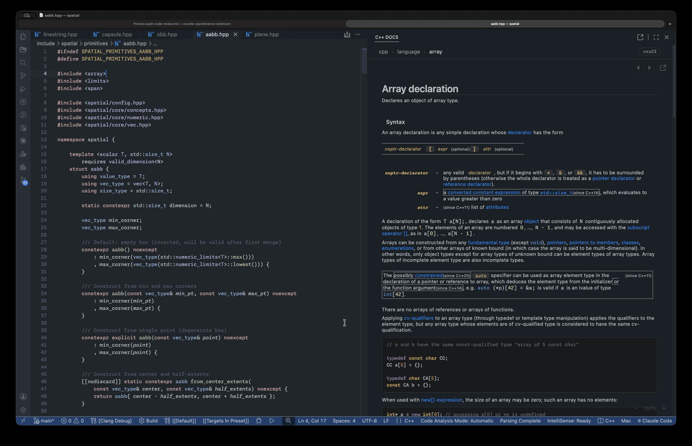
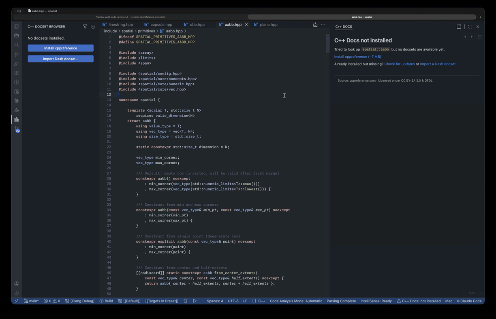
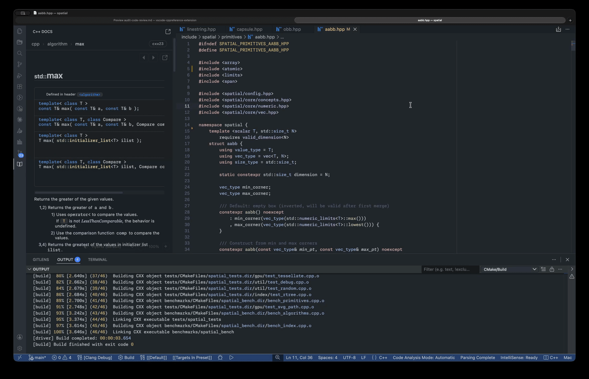
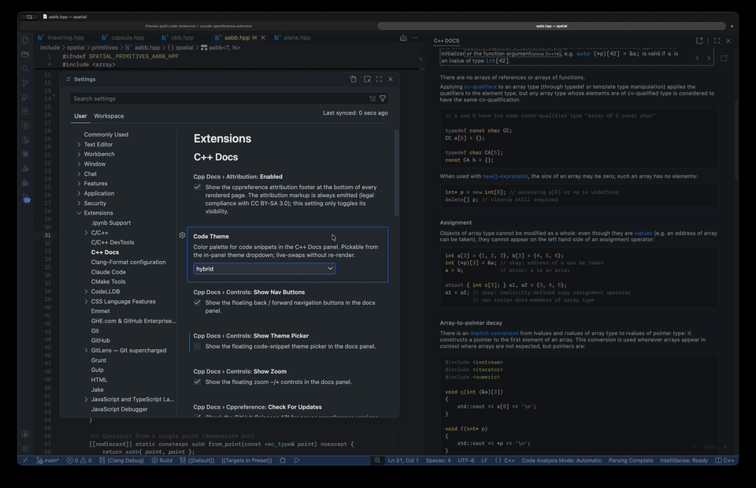

# **C/C++ Documentation Viewer**

Offline [cppreference](https://cppreference.com/) documentation inside VS Code — cursor-follow, hover snippets, and a full symbol browser.

---

---

This extension provides the entirety of cppreference intergrated directly into your editor. Select any standard library symbol — `std::sort`, `std::optional`, `std::vector::erase` — and the complete page opens in a side panel.

Overloads, complexity, exception guarantees, usage examples, etc. All of it, beside your code.

---

## Features

### Cursor-follow panel

As you navigate C++ source, the docs panel resolves the symbol under the cursor and loads the matching cppreference page automatically. The panel is sticky — moving to an unresolvable position (whitespace, a comment, a user-defined name with no index entry) leaves the last useful page in place rather than going blank.

Resolution uses a chain of strategies: C++ keyword short-circuit → clangd `symbolInfo` → hover text parsing → definition walking → fallback heuristics. With clangd installed, fully-qualified names are extracted directly from the language server response. Without it, the extension falls back through hover text parsing and definition walking to cover the common cases.

`#include` and preprocessor directive lines are handled by outer wrappers that intercept those positions before the main chain runs.

---

### Symbol browser and installation

The C++ Docs activity bar view shows the full indexed symbol tree: docset at the top level, then category (Function, Class, Macro, …), then individual symbols. Clicking an entry navigates the docs panel without stealing keyboard focus from the editor.

The first time you open the view, a welcome screen offers **Install cppreference**. Clicking it fetches the latest release of [PeterFeicht/cppreference-doc](https://github.com/PeterFeicht/cppreference-doc) from GitHub (~7 MB compressed), verifies the SHA-256 checksum, extracts it, and indexes the bundled Doxygen tag XML. On a typical connection this completes in well under 30 seconds.

Type in the filter box to narrow the tree in real time. The filter icon in the view title bar opens it; clicking it again or pressing the clear button removes the filter.

---

### Flexible panel placement

The docs panel starts in the sidebar. A click on the pop-out icon in the panel title bar moves it into an editor column as a full tab; a click on the dock icon moves it back. Both surfaces share navigation history — the page stays loaded through the move. The editor-tab surface registers a `WebviewPanelSerializer` and restores the last-viewed page automatically on VS Code restart.

The panel can be placed anywhere VS Code allows a webview: the activity bar sidebar, the bottom panel, the right auxiliary sidebar, or any editor column.

---

### Theme and style awareness

Code blocks in the docs are re-tokenized by highlight.js and rendered with an independent color scheme. A floating picker in the bottom-right corner of the panel lets you switch between 30 themes — 15 dark and 15 light — without a page reload. The choice persists across sessions.

The overall page colors track your VS Code theme (light, dark, high-contrast) by binding to VS Code's CSS variables. To use cppreference's stock light palette instead, set `cppDocs.theme.respectVSCodeTheme` to `false`.

---

### Hover snippets

Hovering over a C++ symbol injects a cppreference excerpt into the hover popup — the synopsis table and the first descriptive paragraph — alongside whatever clangd is already showing. The snippet appears below clangd's output in the same popup and may require scrolling if clangd returns a long result.

---

### C++ standard filtering

Every version-annotated element on cppreference (since/until cxx markers) is filtered by the active C++ standard via a CSS style block injected at render time. Set it to C++17 and C++20-only overloads and annotations are hidden. Switch to C++23 and the full picture returns. No page reload occurs — only the visibility rules change.

When set to `auto`, the resolver checks `C_Cpp.default.cppStandard` (the Microsoft C/C++ extension setting) first, then looks for a `-std=` flag in `compile_commands.json`, then falls back to `cppDocs.cppStandard.fallback` (default: `c++20`).

---

### Symbol search

**C++ Docs: Open Symbol** opens a quick-pick over the full aggregate index. Type any substring of a qualified name and the list narrows immediately. Selecting an entry navigates the docs panel regardless of cursor position.

---

### Navigation

Back and forward buttons float in the top-right corner of the docs panel and walk the per-surface history. The breadcrumb below the title bar shows where you are in the cppreference hierarchy; clicking any segment navigates to that page.

A table of contents rail appears on wider panels, built from the page headings and updated with active-section highlighting via `IntersectionObserver` as you scroll. Each heading carries a hover-pilcrow anchor; clicking it writes the deep link URL to the clipboard.

**C++ Docs: Open Current Page in Browser** opens the live `en.cppreference.com` equivalent in your system browser.

---

## Getting started

1. Open the **C++ Docs** activity bar view.
2. Click **Install cppreference**. The extension fetches, verifies, and indexes the cppreference archive (~7 MB). Internet access is only required for this step.
3. Open any `.cpp` or `.c` file and move the cursor. The docs panel opens automatically and loads the matching page.
4. Optional: pin a C++ standard via **C++ Docs: Set C++ Standard**, or leave it on `auto` to read the value from your project configuration.

---

## Settings

| Setting                                 | Default      | Description                                                                                                                                    |
| --------------------------------------- | ------------ | ---------------------------------------------------------------------------------------------------------------------------------------------- |
| `cppDocs.cppStandard`                   | `auto`       | Active standard filter. `auto` reads from `C_Cpp.default.cppStandard`, then `compile_commands.json` `-std=`, then the fallback.                |
| `cppDocs.cppStandard.fallback`          | `c++20`      | Standard used when `auto` resolves no configured value.                                                                                        |
| `cppDocs.panel.enabled`                 | `true`       | Enable the documentation panel.                                                                                                                |
| `cppDocs.panel.followCursor`            | `true`       | Auto-update the panel as the cursor moves.                                                                                                     |
| `cppDocs.panel.followCursorDebounceMs`  | `150`        | Milliseconds to wait after a cursor move before resolving.                                                                                     |
| `cppDocs.panel.onMissBehavior`          | `showLink`   | What to show when the cursor lands on a symbol with no docs page: `stay` (keep last page), `showLink` (show a search prompt), or `clearPanel`. |
| `cppDocs.panel.zoomLevel`               | `1.0`        | Initial zoom level for the docs panel. Adjustable via the in-panel zoom controls.                                                              |
| `cppDocs.hover.enabled`                 | `true`       | Inject cppreference snippets into hover popups.                                                                                                |
| `cppDocs.resolver.preferLanguageServer` | `true`       | Use clangd's `symbolInfo` request as the primary resolution strategy. Disable to skip to hover text parsing.                                   |
| `cppDocs.resolver.timeoutMs`            | `250`        | Per-strategy timeout in milliseconds. Raise if the resolver misses consistently on a slow clangd first-index.                                  |
| `cppDocs.codeTheme`                     | `hybrid`     | Syntax highlight theme for code blocks. 30 options across dark and light palettes.                                                             |
| `cppDocs.theme.respectVSCodeTheme`      | `true`       | Bind page colors to VS Code's CSS variables. Disable to use cppreference's stock light palette.                                                |
| `cppDocs.controls.showZoom`             | `true`       | Show the floating zoom controls in the docs panel.                                                                                             |
| `cppDocs.controls.showThemePicker`      | `true`       | Show the floating code theme picker in the docs panel.                                                                                         |
| `cppDocs.controls.showNavButtons`       | `true`       | Show the floating back/forward navigation buttons in the docs panel.                                                                           |
| `cppDocs.tree.enabled`                  | `true`       | Show the C++ Docs activity bar tree view. Requires a window reload to take effect.                                                             |
| `cppDocs.tree.revealPanelOnSelection`   | `true`       | Reveal the docs panel when selecting a tree entry. When disabled, tree selection only navigates if the panel is already visible.               |
| `cppDocs.attribution.enabled`           | `true`       | Show the cppreference attribution footer. The footer markup is always present (license requirement); this controls visibility only.            |
| `cppDocs.cppreference.version`          | `latest`     | Pin a specific cppreference release tag, or `latest` for the newest available.                                                                 |
| `cppDocs.cppreference.checkForUpdates`  | `true`       | Check for newer cppreference releases on activation.                                                                                           |
| `cppDocs.docsetsRoot`                   | _(computed)_ | Override the directory where docsets are stored. Empty uses the VS Code global storage path. Requires a window reload.                         |

---

## Requirements

- VS Code 1.95 or later.
- A `.cpp` or `.c` file open in the editor — the extension activates only for these language IDs.
- Internet access the first time, for the cppreference archive download. Everything works offline after that.
- [clangd](https://marketplace.visualstudio.com/items?itemName=llvm-vs-code-extensions.vscode-clangd) is optional but improves symbol resolution accuracy. The extension falls back through hover text parsing, definition walking, and keyword matching when clangd is absent or slow to respond.

---

## Troubleshooting

**The panel doesn't update when I move the cursor.**
Confirm `cppDocs.panel.followCursor` is enabled and at least one docset is installed. If the resolver misses consistently, try raising `cppDocs.resolver.timeoutMs` — clangd can be slow during initial indexing. Run **Diagnose Symbol Under Cursor** from the command palette for a full trace of what each resolution strategy returned.

**No hover snippet appears.**
Confirm `cppDocs.hover.enabled` is `true` and that the file language ID is `cpp` or `c` (check the status bar). The snippet appears below clangd's output in the same popup and may require scrolling if clangd returns a long result.

**The cppreference install fails or SHA-256 verification fails.**
GitHub anonymous release downloads are rate-limited. Wait a minute and retry. On a slow or restricted connection, pin a specific release with `cppDocs.cppreference.version` and retry.

**The tree doesn't appear after changing `cppDocs.tree.enabled`.**
That setting is read at activation. Run **Developer: Reload Window** to apply the change.

---

## Privacy

No telemetry is collected. The only outbound network requests this extension makes are to GitHub:

- A version check against the `PeterFeicht/cppreference-doc` Releases API on activation (when `cppDocs.cppreference.checkForUpdates` is on).
- The archive download, only when you explicitly run **Install cppreference**.

**Open Current Page in Browser** opens `en.cppreference.com` in your system browser via VS Code's `openExternal` — that request comes from the browser, not the extension. No requests are made to cppreference.com servers from within the extension process.

---

## License

Extension code: [MIT](LICENSE).

cppreference content is redistributed under [CC BY-SA 3.0](https://creativecommons.org/licenses/by-sa/3.0/) and the GFDL per [Cppreference:Copyright](https://en.cppreference.com/w/Cppreference:Copyright/CC-BY-SA). The per-page attribution footer is always present in the markup as a license condition; `cppDocs.attribution.enabled = false` only hides it visually.

---

## Acknowledgments

- [PeterFeicht/cppreference-doc](https://github.com/PeterFeicht/cppreference-doc) — the HTML archive and Doxygen tag XML this extension installs and indexes.
- [cppreference.com contributors](https://en.cppreference.com/w/Cppreference:About) — the source of every page this extension renders.
