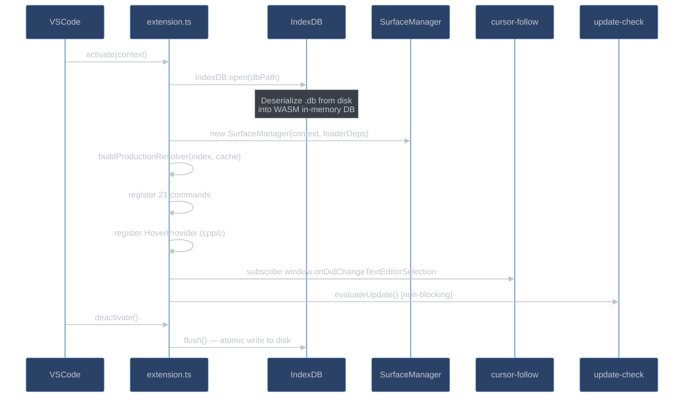
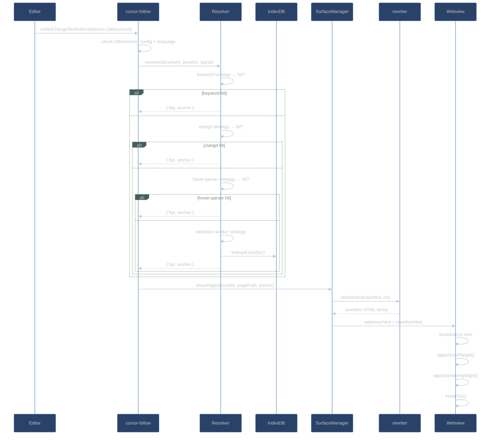
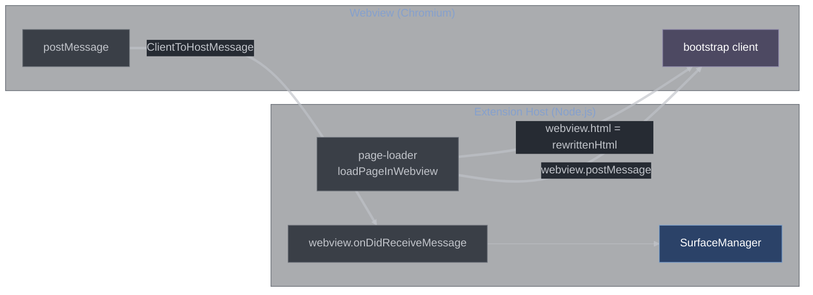
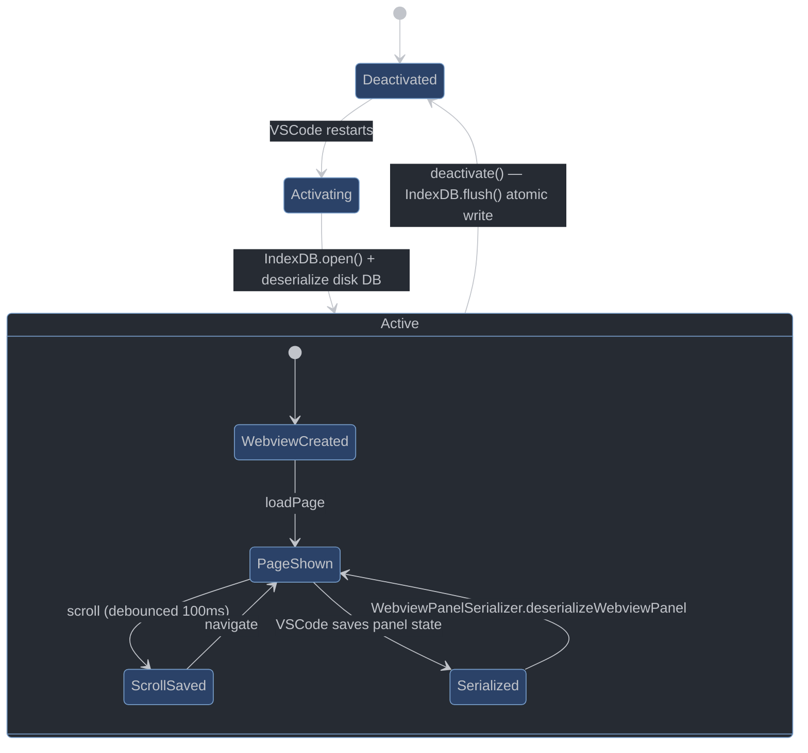

# System Architecture

## High-Level Component Map

```mermaid
---
config:
    theme: 'base'
    curve: 'straight'
    themeVariables:
        darkMode: true
        clusterBkg: '#22272f62'
        clusterBorder: '#6a6f77ff'
        clusterTextColor: '#6a6f77ff'
        lineColor: '#C1C4CAAA'
        background: '#262B33'
        primaryColor: '#2b4268ff'
        primaryTextColor: '#C1C4CAff'
        primaryBorderColor: '#6a6f77ff'
        primaryLabelBkg: '#262B33'
        secondaryColor: '#425f5fff'
        secondaryBorderColor: '#8c9c81ff'
        secondaryTextColor: '#C1C4CAff'
        tertiaryColor: '#4d4962ff'
        tertiaryBorderColor: '#8983a5ff'
        tertiaryTextColor: '#eeeeee55'
        nodeTextColor: '#C1C4CA'
        defaultLinkColor: '#C1C4CA'
        edgeLabelBackground: '#262B33'
        edgeLabelBorderColor: '#C1C4CA'
        labelTextColor: '#C1C4CA'
        errorBkgColor: '#724848ff'
        errorTextColor: '#C1C4CA'
        flowchart:
            curve: 'basis'
            nodeSpacing: 50
            rankSpacing: 50
            subGraphTitleMargin:
                top: 15
                bottom: 15
                left: 15
                right: 15
---
flowchart TB
    subgraph Host["VSCode Host Process"]
        EXT["extension.ts<br/>Activation + Wiring"]:::accent

        subgraph Docset["Docset Subsystem"]
            DM["DocsetManager"]:::neutral
            IDB["IndexDB<br/>SQLite-WASM"]:::neutral
            CI["cppreference<br/>Installer"]:::neutral
            CIX["cppreference<br/>Indexer"]:::neutral
            UC["Update Check"]:::neutral
        end

        subgraph Resolver["Resolver Subsystem"]
            CPP["composeResolver<br/>Strategy chain"]:::blue
            KW["keyword"]:::neutral
            CL["clangd-bridge"]:::neutral
            HP["hover-parser"]:::neutral
            DW["definition-walker"]:::neutral
            FB["fallback"]:::neutral
            CACHE["LRU Cache<br/>256 entries"]:::neutral
            IA["include-aware wrapper"]:::neutral
            DA["directive-aware wrapper"]:::neutral
            CF["cursor-follow"]:::neutral
        end

        subgraph UI["UI Subsystem"]
            SM["SurfaceManager"]:::blue
            NH["NavigationHistory"]:::neutral
            PL["page-loader"]:::neutral
            HP2["HoverProvider"]:::neutral
            CSM["CppStandardManager"]:::neutral
            TP["TreeProvider"]:::neutral
        end

        subgraph WHost["Webview Host"]
            RW["rewriter.ts<br/>SAX pipeline"]:::neutral
            TM["template.ts<br/>CSS + HTML gen"]:::neutral
            SN["snippet.ts<br/>FSM extractor"]:::neutral
            SC["snippet-cache<br/>64 entries"]:::neutral
            CT["code-themes.ts<br/>30 base16 themes"]:::neutral
            HH["hover-highlight.ts"]:::neutral
        end
    end

    subgraph WClient["Webview Renderer (Chromium)"]
        WC["index.ts<br/>Bootstrap"]:::accent
        SX["syntax.ts<br/>hljs"]:::neutral
        TOC["toc.ts"]:::neutral
        NAV["nav.ts<br/>click intercept"]:::neutral
        ST["state.ts<br/>scroll + persist"]:::neutral
        CTH["code-theme.ts"]:::neutral
    end

    EXT --> DM & SM & CF & HP2 & CSM & TP
    DM --> IDB
    DM --> CI
    CI --> CIX
    UC --> DM
    CF --> CPP
    CPP --> KW & CL & HP & DW & FB
    CPP --> CACHE & IA & DA
    FB --> IDB
    KW --> IDB
    HP2 --> CPP & SN & SC & HH
    SM --> NH & PL
    PL --> RW & TM
    RW --> TM
    WC --> SX & TOC & NAV & ST & CTH
    NAV -.->|postMessage| PL
    ST -.->|postMessage| SM

    classDef neutral fill:#3a3f47,stroke:#6a6f77,color:#C1C4CA
    classDef accent fill:#4d4962,stroke:#8983a5,color:#ffffff
    classDef blue fill:#2b4268,stroke:#779DC9,color:#ffffff
```



## Activation and Wiring (`extension.ts`)

`extension.ts` is the single composition root. The VSCode runtime calls `activate(context)` when any `onLanguage:cpp/c` or `onWebviewPanel:cppDocs.viewer` event fires.



Key module-scoped singletons created at activation:

| Variable                 | Type                  | Purpose                           |
| ------------------------ | --------------------- | --------------------------------- |
| `docsets`                | `DocsetManager`       | Central docset registry           |
| `surfaces`               | `SurfaceManager`      | Owns the single active webview    |
| `cppStandard`            | `CppStandardManager`  | Tracks current C++ standard       |
| `statusItem`             | `StatusBarItem`       | Standard indicator in status bar  |
| `welcome`                | `WelcomeState`        | First-run welcome page state      |
| `treeProvider`           | `DocsetTreeProvider`  | Symbol tree data provider         |
| `treeView`               | `TreeView`            | The actual tree UI                |
| `updateAvailableVersion` | `string \| undefined` | Cached latest version from GitHub |

## Data Flow: Cursor → Webview

This diagram traces the full end-to-end flow from cursor movement to rendered documentation.



## Process Boundary: Extension Host ↔ Webview

The extension host (Node.js) and the webview (Chromium) are separate processes. Communication is strictly message-based.



**Message types:**

| Direction     | Message         | Payload                    | Handler                                        |
| ------------- | --------------- | -------------------------- | ---------------------------------------------- |
| Host → Client | `loadPage`      | `{ html, scrollTarget }`   | Replaces document HTML                         |
| Host → Client | `setStandard`   | `{ token }`                | Updates `body[data-cpp-std]`                   |
| Host → Client | `setZoom`       | `{ factor }`               | Sets `--cppref-zoom` CSS var                   |
| Host → Client | `setCodeTheme`  | `{ vars }`                 | Replaces `<style id="cppref-code-theme-vars">` |
| Host → Client | `setActive`     | `{ docsetId, pagePath }`   | Updates VSCode state persistence               |
| Client → Host | `nav`           | `{ pagePath, anchor? }`    | Triggers page load                             |
| Client → Host | `openExternal`  | `{ href }`                 | Opens external URL in browser                  |
| Client → Host | `setState`      | `{ scrollY }`              | Persists scroll position                       |
| Client → Host | `zoomDelta`     | `{ delta }`                | Adjusts zoom factor                            |
| Client → Host | `pickCodeTheme` | `{ themeId }`              | Saves + broadcasts new theme                   |
| Client → Host | `runCommand`    | `{ command, args }`        | Executes VSCode command                        |
| Client → Host | `click`         | `{ classification, href }` | Diagnostic click telemetry                     |
| Client → Host | `ready`         | —                          | Bootstrap complete signal                      |

## Security Model

Every webview uses a strict Content Security Policy injected as the very first `<meta>` tag in `<head>` (before any cppreference scripts can run):

```
default-src 'none';
script-src 'nonce-<random>';
style-src 'unsafe-inline' <webview.cspSource>;
img-src <webview.cspSource> data: https:;
font-src <webview.cspSource> data:;
```

- `default-src 'none'` blocks all resource loads by default.
- Scripts require a per-render nonce (`bootstrap.js` is the only allowed script).
- All cppreference `<script>` tags are stripped by the rewriter before the page is served — CSP is defense-in-depth, not the primary mechanism.
- Inline styles are allowed (cppreference uses them for layout).
- External images are allowed over HTTPS (cppreference diagram images).

## State Persistence Across Restarts



The `WebviewPanelSerializer` (in `src/ui/surface/serialize/`) restores editor panels after a VSCode restart by reading the persisted `SerializedPanelState` (`{ docsetId, pagePath, scrollY }`), which is kept in sync via the `setActive` message flow.

## Module Dependency Graph

```mermaid
---
config:
    theme: 'base'
    curve: 'straight'
    themeVariables:
        darkMode: true
        clusterBkg: '#22272f62'
        clusterBorder: '#6a6f77ff'
        clusterTextColor: '#6a6f77ff'
        lineColor: '#C1C4CAAA'
        background: '#262B33'
        primaryColor: '#2b4268ff'
        primaryTextColor: '#C1C4CAff'
        primaryBorderColor: '#6a6f77ff'
        primaryLabelBkg: '#262B33'
        nodeTextColor: '#C1C4CA'
        defaultLinkColor: '#C1C4CA'
        edgeLabelBackground: '#262B33'
        edgeLabelBorderColor: '#C1C4CA'
        labelTextColor: '#C1C4CA'
        flowchart:
            curve: 'basis'
            nodeSpacing: 50
            rankSpacing: 50
            subGraphTitleMargin:
                top: 15
                bottom: 15
                left: 15
                right: 15
---
flowchart TD
    EXT["extension.ts"]:::accent

    subgraph DocsetSub["docset"]
        DM2["manager"]:::neutral
        IDB2["index"]:::neutral
        SCH["schema"]:::neutral
        TYP["types"]:::neutral
        INS["installer"]:::neutral
        IDX["indexer"]:::neutral
        PP["postprocess"]:::neutral
        UPC["update-check"]:::neutral
    end

    subgraph ResolverSub["resolver"]
        CPP2["cpp"]:::blue
        CACHE2["cache"]:::neutral
        KW2["keyword"]:::neutral
        CL2["clangd-bridge"]:::neutral
        HP3["hover-parser"]:::neutral
        DW2["definition-walker"]:::neutral
        FB2["fallback"]:::neutral
        IA2["include-aware"]:::neutral
        DA2["directive-aware / cursor-follow"]:::neutral
        RT["types"]:::neutral
    end

    subgraph UISub["ui"]
        SM3["surface/manager"]:::blue
        NH2["surface/navigation"]:::neutral
        PL2["surface/page-loader"]:::neutral
        HP4["hover-provider"]:::neutral
        CSM2["cpp-standard-manager"]:::neutral
        CS["cpp-standard"]:::neutral
    end

    subgraph WHSub["webview-host"]
        RW2["rewriter"]:::neutral
        TM2["template"]:::neutral
        SN2["snippet"]:::neutral
        SC2["snippet-cache"]:::neutral
        CT2["code-themes"]:::neutral
        HH2["hover-highlight"]:::neutral
        MSG["messages"]:::neutral
    end

    EXT --> DM2 & CPP2 & SM3 & HP4 & CSM2
    DM2 --> IDB2 & INS
    INS --> IDX & PP
    IDB2 --> SCH & TYP
    CPP2 --> CACHE2 & KW2 & CL2 & HP3 & DW2 & FB2 & IA2 & RT
    FB2 --> IDB2
    SM3 --> NH2 & PL2
    PL2 --> RW2 & TM2
    RW2 --> TM2
    HP4 --> CPP2 & SN2 & SC2 & HH2
    CSM2 --> CS
    MSG -.->|imported by| PL2 & SM3

    classDef neutral fill:#3a3f47,stroke:#6a6f77,color:#C1C4CA
    classDef accent fill:#4d4962,stroke:#8983a5,color:#ffffff
    classDef blue fill:#2b4268,stroke:#779DC9,color:#ffffff
```


