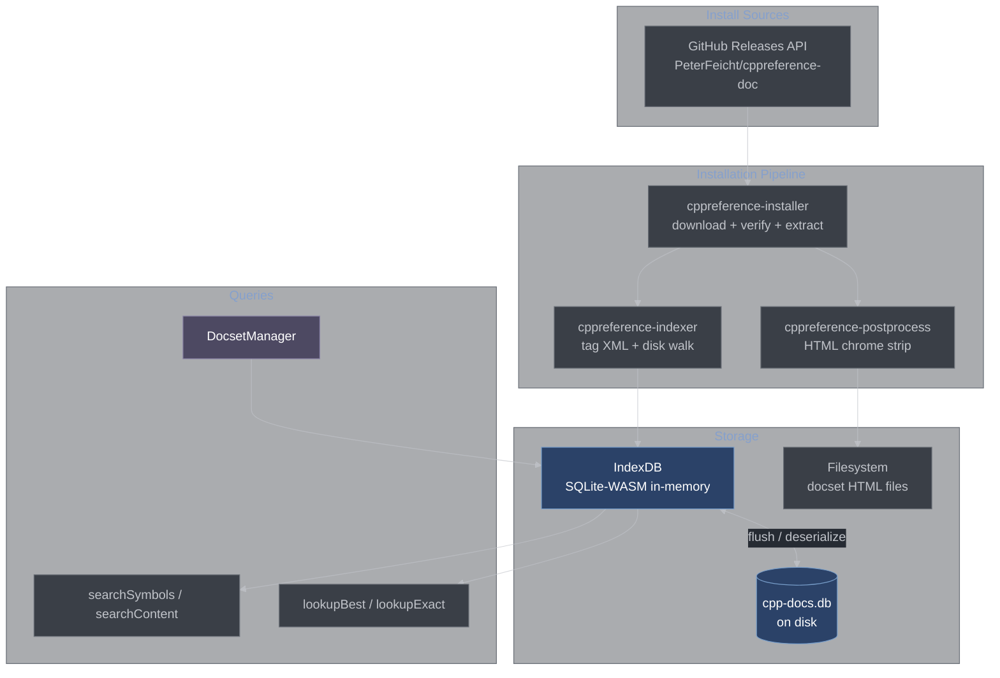
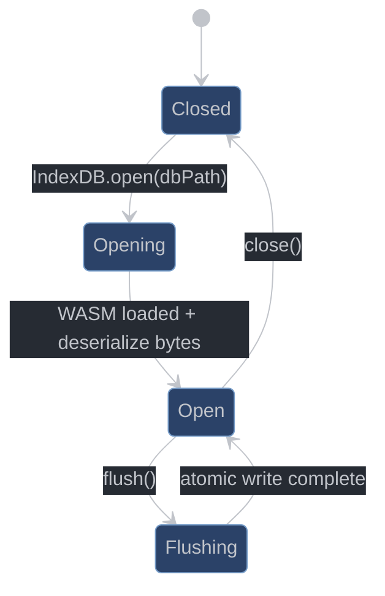
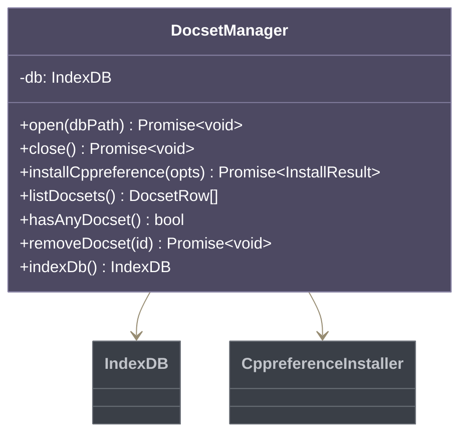
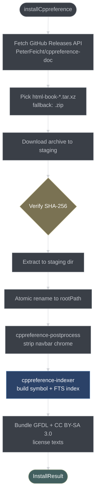
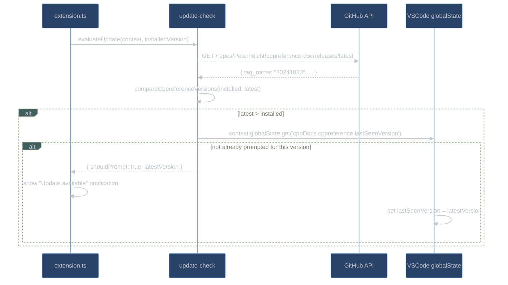
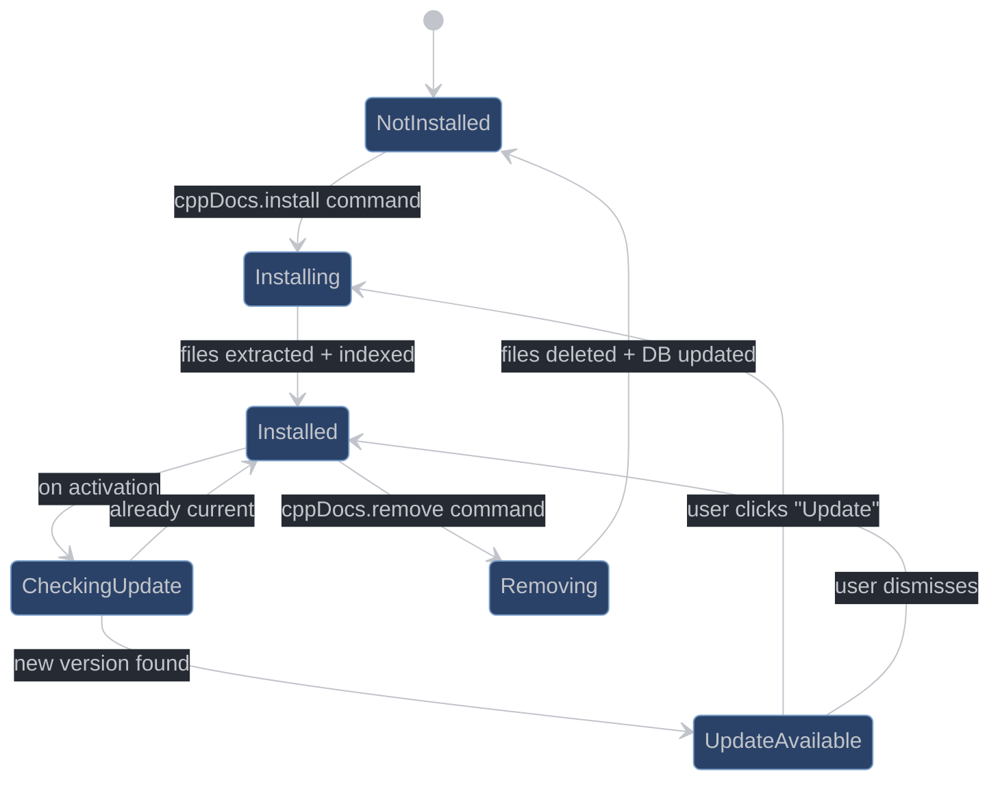

# Docset Management

This document covers everything related to acquiring, indexing, storing, and querying documentation sets: the SQLite schema, the IndexDB abstraction, the cppreference download+index pipeline, and the update-check system.

## Overview



## Database Schema

Defined in [src/docset/schema.ts](src/docset/schema.ts). Schema version 2; migrations from v1 are applied at `open()`.

### Table: `docsets`

```sql
CREATE TABLE docsets (
    id           INTEGER PRIMARY KEY AUTOINCREMENT,
    name         TEXT NOT NULL,
    source       TEXT NOT NULL,    -- 'cppreference'
    version      TEXT NOT NULL,
    root_path    TEXT NOT NULL,    -- absolute path to docset directory
    documents_dir TEXT NOT NULL,   -- absolute path to HTML files root
    index_format TEXT NOT NULL,    -- 'searchIndex'
    installed_at TEXT NOT NULL,    -- ISO 8601 timestamp
    is_active    INTEGER NOT NULL DEFAULT 1
);
```

### Table: `symbols`

```sql
CREATE TABLE symbols (
    id             INTEGER PRIMARY KEY AUTOINCREMENT,
    docset_id      INTEGER NOT NULL REFERENCES docsets(id),
    qualified_name TEXT NOT NULL,   -- e.g. "std::vector::push_back"
    unqualified    TEXT NOT NULL,   -- e.g. "push_back"
    parent         TEXT NOT NULL,   -- e.g. "std::vector"
    kind           TEXT NOT NULL,   -- "Function", "Class", "Header", ...
    file_path      TEXT NOT NULL,   -- relative to documents_dir
    anchor         TEXT NOT NULL,   -- empty string or fragment id
    arglist        TEXT NOT NULL    -- "(T&&)" or ""
);

CREATE INDEX idx_symbols_docset   ON symbols(docset_id);
CREATE INDEX idx_symbols_qual     ON symbols(qualified_name COLLATE NOCASE);
CREATE INDEX idx_symbols_unqual   ON symbols(unqualified COLLATE NOCASE);
CREATE INDEX idx_symbols_parent   ON symbols(parent COLLATE NOCASE);
CREATE INDEX idx_symbols_file     ON symbols(file_path);
```

### Table: `fts_pages`

```sql
CREATE VIRTUAL TABLE fts_pages USING fts5(
    docset_id UNINDEXED,
    file_path UNINDEXED,
    title,
    body,
    tokenize = 'porter ascii'
);
```

FTS5 with Porter stemmer enables stemmed word matching (searching "iterator" finds "iterators", "iterating"). `docset_id` and `file_path` are `UNINDEXED` — stored but not tokenized, used for filtering.

## IndexDB

[src/docset/index.ts](src/docset/index.ts) — 733 lines. The SQLite-WASM wrapper.

### Lifecycle



**`open(dbPath)`** — async:
1. Loads the `@sqlite.org/sqlite-wasm` WASM module (lazy, cached).
2. Reads the `.db` file from disk (or starts empty if not found).
3. Calls `sqlite3_deserialize()` to load the bytes into an in-memory database.
4. Runs `PRAGMA journal_mode=MEMORY` and `PRAGMA synchronous=OFF` (safe because all durability is in `flush()`).
5. Applies schema migrations if the stored `user_version` is below current.

**`flush(dbPath)`** — async:
1. Calls `sqlite3_js_db_export()` to get the full in-memory DB as a `Uint8Array`.
2. Writes to `<dbPath>.tmp` then `fs.rename()` to `<dbPath>` — atomic on POSIX.
3. Called at extension `deactivate()` and after each install.

### Lookup Methods

| Method                             | Strategy                                           | Use case            |
| ---------------------------------- | -------------------------------------------------- | ------------------- |
| `lookupExact(fqn)`                 | `qualified_name = ? COLLATE NOCASE`                | Direct FQN match    |
| `lookupBest(fqn)`                  | Exact → stripped `::` → unqualified fallback       | Resolver strategies |
| `lookupByUnqualified(name, scope)` | `unqualified = ?` ranked by parent scope proximity | Fallback resolver   |
| `searchPrefixCI(prefix)`           | Binary range scan on lowercase index               | Symbol search UI    |
| `searchSymbolsForFilter(query)`    | `LIKE '%query%' COLLATE NOCASE`                    | Tree view filter    |
| `searchContent(query)`             | FTS5 `MATCH ? ORDER BY rank`                       | Full-text search    |

**`lookupBest` fallback chain:**

```
1. qualified_name = 'std::vector::push_back' COLLATE NOCASE
         ↓ (no hit)
2. qualified_name = 'vector::push_back' COLLATE NOCASE
   (strips one leading '::' scope segment)
         ↓ (no hit)
3. unqualified = 'push_back' COLLATE NOCASE
   ORDER BY (parent = 'std::vector') DESC, length(parent) DESC
```

**`lookupByUnqualified`** ranks by parent scope proximity: exact parent match first, then longest parent match (most specific namespace wins).

### Batch Insert

`insertSymbols(docsetId, symbols[])` uses a prepared statement inside a single transaction. For large docsets (cppreference has ~18,000 symbols) this is 5–10× faster than per-row transactions.

`indexPageContent(docsetId, pages[])` inserts into `fts_pages` in 200-page batches, then runs `INSERT INTO fts_pages(fts_pages) VALUES('optimize')` at the end to merge FTS5 segment files.

## DocsetManager

[src/docset/manager.ts](src/docset/manager.ts) — Thin orchestration layer.



**Key design:** `installCppreference()` always calls `registerDocset()` and `runIndexer()` even when the HTML files are already current. This ensures that if the extension updates its indexer logic (new DISK_RULES, new FTS content extraction), a reinstall picks up the changes without requiring the user to delete and re-download the 300MB archive.

`indexDb()` exposes the raw `IndexDB` for the resolver's fallback strategy, which needs direct lookup access.

## cppreference Installer

[src/docset/cppreference-installer.ts](src/docset/cppreference-installer.ts)



**Version pinning:** If `cppDocs.cppreference.pinnedTag` is set in config, that specific GitHub release tag is fetched instead of the latest. Default behavior fetches the latest release.

**Atomic extract:** Files are extracted to a staging directory first, then renamed into the final `rootPath`. This means the old docset remains readable until the new one is fully ready.

**Returns:**
```typescript
type InstallResult = {
    status: 'installed' | 'already-current';
    version: string;
    rootPath: string;
};
```

## cppreference Indexer

[src/docset/cppreference-indexer.ts](src/docset/cppreference-indexer.ts) — Two-phase approach.

### Phase 1: Doxygen Tag XML

The cppreference archive includes `Docs/cppreference.tag`, a Doxygen XML file listing all documented symbols with their file paths and anchor IDs. SAX-parsed via `saxes`.

```xml
<compound kind="class">
  <name>std::vector</name>
  <member kind="function">
    <name>push_back</name>
    <anchorfile>en/cpp/container/vector/push_back.html</anchorfile>
    <anchor>push_back</anchor>
    <arglist>(const T &amp;value)</arglist>
  </member>
</compound>
```

Each `<compound>` and `<member>` becomes a `SymbolInsert`. The tag XML covers most of the standard library but misses some pages (C compatibility headers, preprocessor macros, some language pages).

### Phase 2: Disk Walk

The indexer walks `en/cpp/` and `en/c/` for `.html` files not already covered by the tag XML. `DISK_RULES` maps path prefixes to symbol kinds:

```typescript
const DISK_RULES: DiskRule[] = [
    { prefix: 'en/cpp/keyword/', kind: 'Keyword', parent: '' },
    { prefix: 'en/cpp/preprocessor/', kind: 'Macro', parent: '' },
    { prefix: 'en/cpp/header/', kind: 'Header', parent: '' },
    { prefix: 'en/c/header/', kind: 'Header', parent: '' },
    // ... more rules
];
```

`extractTitleTokens()` parses comma-separated titles respecting `<>` depth (so `std::pair<T1, T2>` isn't split at the comma). `resolveDiskSymbol()` derives `qualifiedName`, `unqualified`, and `parent` from these tokens.

For HTML pages with `#define` or `constexpr` declaration tables, `detectKindFromHtml()` overrides the kind to `Macro` or `EnumerationValue`.

### FTS Content Indexing

After symbol indexing, the indexer reads each HTML file and extracts body text for FTS5. Content is extracted in 200-page batches to avoid memory pressure on the ~11,000 page cppreference corpus.

## cppreference Postprocessor

[src/docset/cppreference-postprocess.ts](src/docset/cppreference-postprocess.ts)

Run once at install time on every HTML file. Strips chrome elements that are useless (and potentially broken) in the webview context:

| Removed class           | Description            |
| ----------------------- | ---------------------- |
| `t-navbar`              | Top navigation bar     |
| `t-cppreference-source` | "Edit this page" links |
| `noprint`               | Print-only elements    |
| `mw-jump-link`          | Jump-to links          |
| `printfooter`           | Print footer           |

Uses `htmlparser2` with depth-tracking skip (same SAX approach as the runtime rewriter, but for permanent mutation of the installed files).

`stripCppreferenceChrome(html)` is exported as a pure function and is unit tested in isolation.

## Update Check

[src/docset/update-check.ts](src/docset/update-check.ts)

Polls the GitHub Releases API for new cppreference versions on extension activation. Runs non-blocking (result is ignored if it fails).



**`compareCppreferenceVersions(a, b)`:** Pure lexicographic comparison of date-stamp strings (`"20241030"` > `"20231016"`). This function is unit tested.

**Deduplication:** The `lastSeenVersion` memento in `globalState` prevents prompting more than once per version. If the user dismisses the notification, they won't see it again for that version.

## Docset Lifecycle Summary


