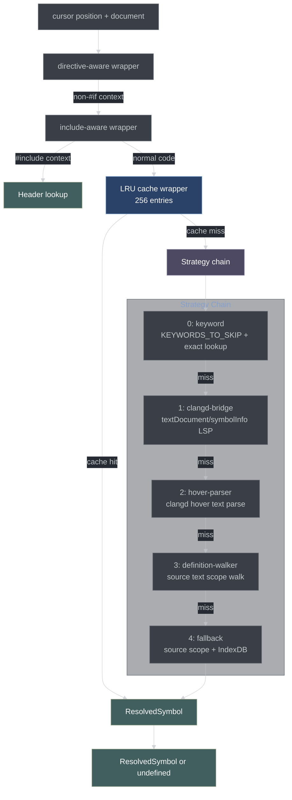
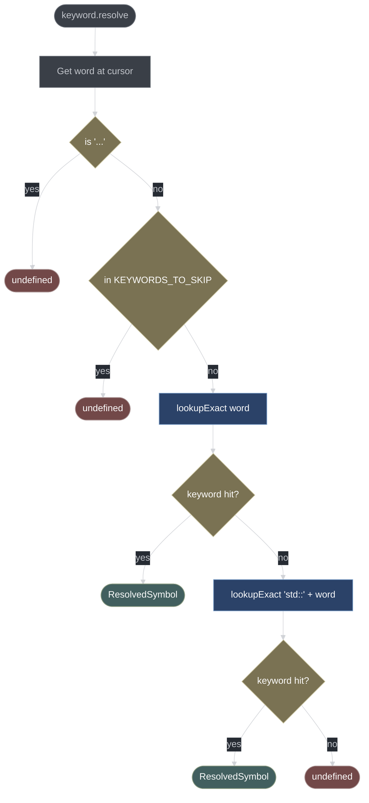
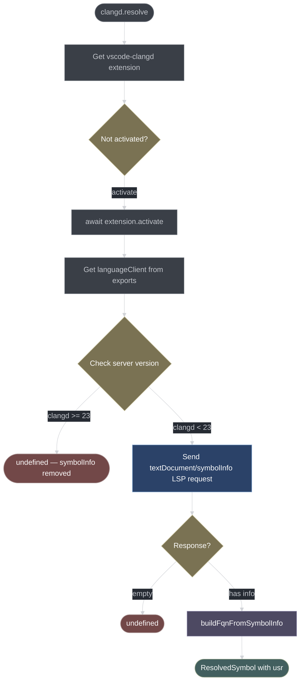
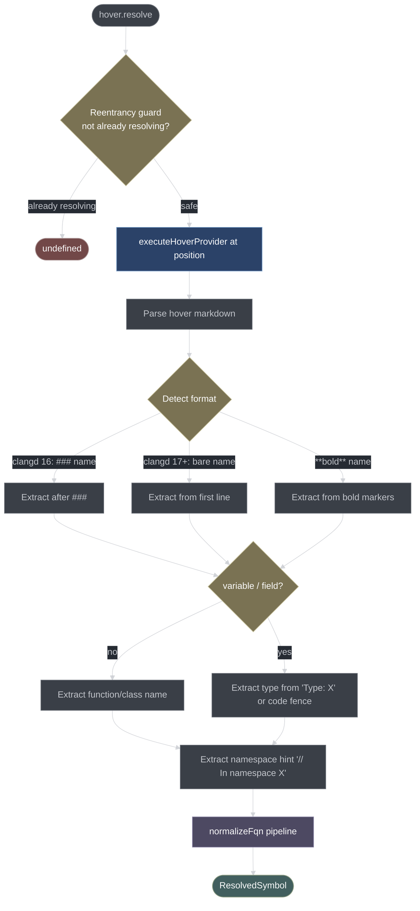
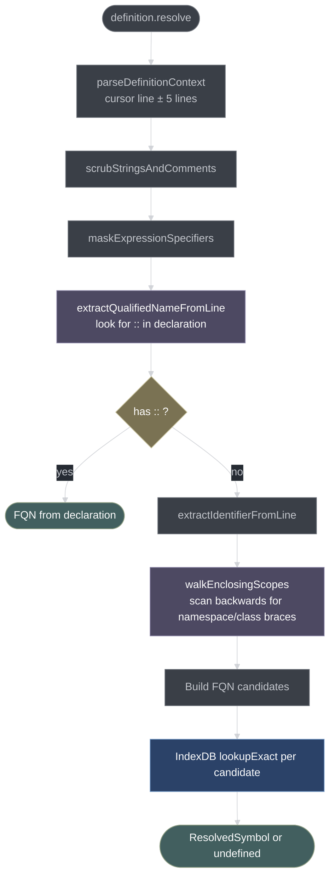
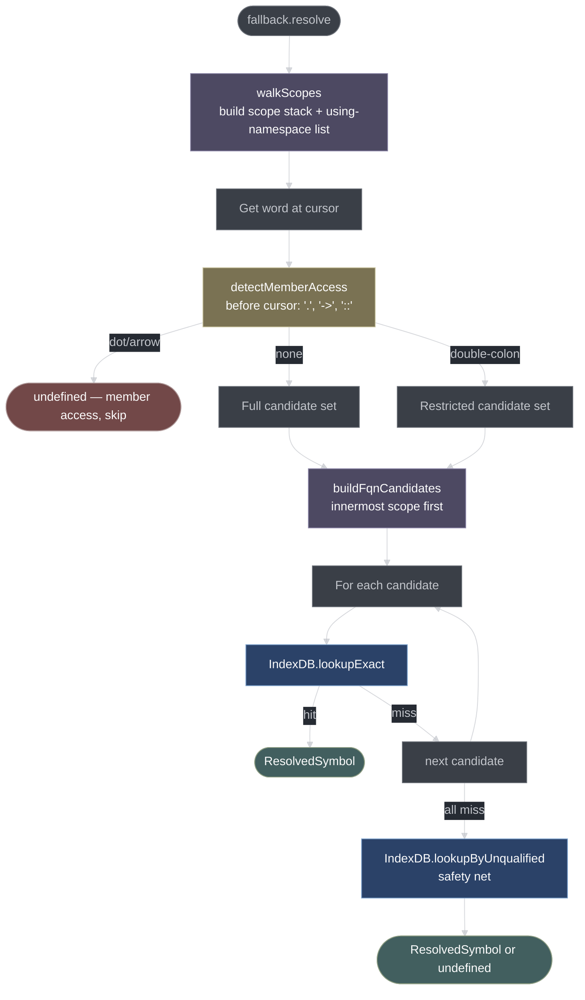
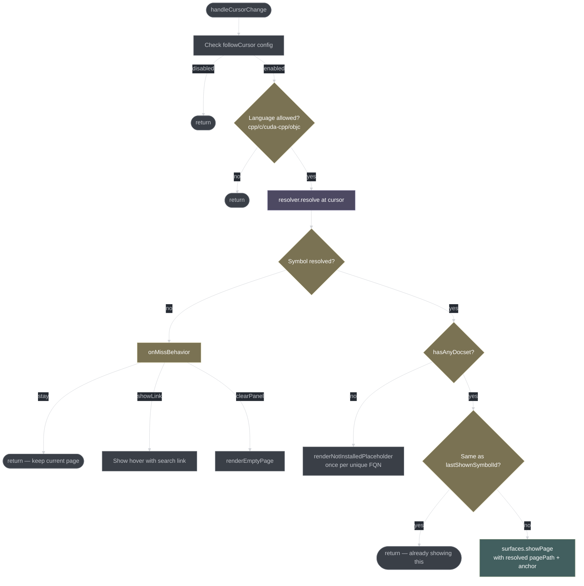

# Symbol Resolution

The resolver is the core intelligence of the extension. Given a cursor position in a C++ source file, it must determine the fully-qualified name (FQN) of the symbol under the cursor so that the correct documentation page can be looked up in the index.

## Architecture



Each strategy races against a configurable timeout via `AbortController`. If it times out, the next strategy is tried.

## Resolver Types

[src/resolver/types.ts](src/resolver/types.ts)

```typescript
interface ResolveContext {
    document: TextDocument;
    position: Position;
    signal: AbortSignal;   // cancellation from cursor change or hover timeout
}

interface ResolvedSymbol {
    fqn: string;           // "std::vector::push_back"
    source?: string;       // which strategy resolved it
    usr?: string;          // clangd USR if available
    anchor?: string;       // fragment id for anchor scroll
}

type ResolverStrategyName = 'keyword' | 'clangd' | 'hover' | 'definition' | 'fallback';

interface ResolverStrategy {
    name: ResolverStrategyName;
    resolve(ctx: ResolveContext): Promise<ResolvedSymbol | undefined>;
}
```

## Strategy Composition

[src/resolver/cpp.ts](src/resolver/cpp.ts)

`composeResolver(strategies, timeoutMs)` iterates the strategy array in order. Each strategy is raced against a timeout:

```typescript
async function raceStrategy(
    strategy: ResolverStrategy,
    ctx: ResolveContext,
    timeoutMs: number
): Promise<ResolvedSymbol | undefined> {
    return Promise.race([
        strategy.resolve(ctx),
        new Promise<undefined>((resolve) => setTimeout(() => resolve(undefined), timeoutMs))
    ]);
}
```

`buildProductionResolver()` assembles the full chain with wrappers:

```typescript
const composed = composeResolver([keyword, clangd, hover, definition, fallback]);
const withCache = wrapWithCache(composed, cache);
const withInclude = wrapWithIncludeAwareness(withCache, indexDb);
const withDirective = wrapWithDirectiveAwareness(withInclude);
return withDirective;
```

**Wrapper order matters:**
- `wrapWithDirectiveAwareness` is outermost: catches `#if`/`#ifdef` directives before the keyword strategy would try to look them up.
- `wrapWithIncludeAwareness` is next: `#include <vector>` routes to a Header lookup, bypassing the full chain.
- `wrapWithCache` is innermost: cache keying only fires on actual code symbols (after directive/include filtering).

## Cache Wrapper

[src/resolver/cache.ts](src/resolver/cache.ts)

Map-based LRU, capacity 256. Cache key: `"${uri}|${version}|${line}:${character}"`.

```typescript
type CacheEntry = ResolvedSymbol | null;
// null = cached miss (symbol looked up but not found)
// undefined = not in cache (never looked up)
```

The `null` vs `undefined` distinction is critical:
- `null` cached entry → skip the inner resolver (it already failed here), return `undefined` to caller.
- `undefined` in cache map → call the inner resolver, then store the result (`ResolvedSymbol`) or `null` (for miss).

This means a failed lookup at a position is not retried on subsequent hovers, which prevents the resolver chain from running 5 strategies every time the cursor sits on an unresolvable token.

Document `version` is included in the key so edits immediately invalidate the cached entry for that position without needing to flush the whole cache.

## Strategy 0: Keyword

[src/resolver/keyword.ts](src/resolver/keyword.ts)

The fastest strategy. Checks the word at the cursor against a hardcoded skip-list and then the IndexDB.



**`isKeywordHit()`** accepts a symbol row as a keyword match if either:
- `kind === 'Keyword'` or `kind === 'Language'`, or
- `filePath` matches `/(?:keywords?|language)\//` (some cppreference pages are filed under `keyword/` directory).

**`KEYWORDS_TO_SKIP`** — C++ keywords that don't have documentation pages and would produce false IndexDB matches if looked up: `if`, `else`, `for`, `while`, `return`, `auto`, `this`, `true`, `false`, `nullptr`, etc.

**`isOnEllipsis()`** detects parameter-pack `...` which shouldn't be resolved.

The `std::` fallback lookup exists because some cppreference pages are indexed under their standard-qualified name (`std::nullptr_t`) but the cursor word is just `nullptr_t`.

## Strategy 1: Clangd Bridge

[src/resolver/clangd-bridge.ts](src/resolver/clangd-bridge.ts)

Uses the `textDocument/symbolInfo` LSP request to get the symbol's fully-qualified name and USR directly from clangd.



**Version gate:** `textDocument/symbolInfo` was removed in clangd 23. The bridge checks `serverInfo.version` from the LSP `initialize` response and skips if major version ≥ 23.

**`buildFqnFromSymbolInfo()`** strips template arguments from the `containerName` field (clangd sometimes includes them) then concatenates `containerName + "::" + name`.

**`raceWithAbort()`** wraps the LSP Promise with the `AbortSignal` so cursor movement or hover timeout cancels the in-flight request.

## Strategy 2: Hover Parser

[src/resolver/hover-parser.ts](src/resolver/hover-parser.ts)

Calls `vscode.executeHoverProvider` (triggering clangd's hover) and parses the returned markdown to extract the FQN.

This is the most complex strategy because clangd's hover format changed significantly between versions 16 and 17+.



**`normalizeFqn()` pipeline:**
1. `sanitizeAliasDecoration()` — removes `[aka ...]` suffixes clangd adds for type aliases.
2. `stripTemplateArgs()` — removes `<...>` template argument lists (with `<>` depth tracking). Special-cases `operator<`, `operator>`, `operator<<=`, etc. so operator overloads aren't mangled.
3. `stripAbiNamespaces()` — removes `::__1::`, `::__cxx11::`, `::__debug::` etc. (libc++/libstdc++ internal namespaces). Implemented in [src/util/fqn.ts](src/util/fqn.ts).
4. `normalizeConstructor()` — rewrites `std::vector::vector` → `std::vector::vector` (preserves constructor FQN).
5. `normalizeDestructor()` — rewrites `std::vector::~vector` → `std::vector::~vector` (preserves destructor FQN).

**`maskExpressionSpecifiers()`** replaces `decltype(...)`, `sizeof(...)`, `alignof(...)`, and cast operator bodies with placeholder strings before parsing. Without this, parentheses inside expression specifiers confuse the function name extraction logic.

## Strategy 3: Definition Walker

[src/resolver/definition-walker.ts](src/resolver/definition-walker.ts)

Reads the source file text and extracts the FQN by parsing the declaration at the cursor line and walking enclosing scopes.



**`scrubStringsAndComments()`** handles:
- `//` line comments (mask rest of line)
- `/* */` block comments (track nesting depth)
- `"..."` string literals (handle `\"` escaping)
- `'...'` char literals
- `R"(...)"` raw string literals

This is necessary because `{` inside strings and comments would corrupt the brace-depth counting used for scope detection.

**`walkEnclosingScopes()`** scans backwards from the cursor line:
- Tracks `{` / `}` depth to find enclosing scope openings.
- At each scope opener, tries to parse a `namespace X` or `class/struct X` declaration.
- Builds the scope stack innermost-first.

**`extractQualifiedNameFromLine()`** looks for patterns like `ReturnType Scope::method(args)` in out-of-line definitions and extracts the `Scope::method` part directly — avoiding the scope walk entirely for this common case.

## Strategy 4: Fallback

[src/resolver/fallback.ts](src/resolver/fallback.ts)

The last resort. Performs a source-level scope walk to build candidate FQNs, then looks each up in the IndexDB.



**`buildFqnCandidates()`** generates candidates in this priority order:
1. Innermost scope: `InnermostClass::word`
2. Each enclosing scope outward: `Outer::Inner::word`, `Outer::word`
3. Each `using namespace X`: `X::word`
4. Bare word: `word`

**`detectMemberAccess()`** scans the source text immediately before the cursor position (ignoring whitespace) to detect:
- `.` — instance member access → skip (member name without object type is not resolvable)
- `->` — pointer member access → skip
- `::` — scope resolution → use restricted candidate set (only fully-qualified candidates)

## Include-Aware Wrapper

[src/resolver/include-aware.ts](src/resolver/include-aware.ts)

Short-circuits the resolver chain when the cursor is inside an `#include` directive.

**`detectIncludeContext()`** examines the current line:
- `#include "..."` (quoted) → always returns `undefined`. Project headers don't appear in the docs index.
- `#include <X>` (system header) → returns `{ kind: 'system', header: X }`.

For system headers, calls `indexDb.lookupExact(X)` restricted to `kind === 'Header'`. If found, returns the Header symbol. Otherwise `undefined`.

This means hovering over `#include <vector>` takes you directly to the `<vector>` header page without running any of the five strategies.

## Cursor Follow

[src/resolver/cursor-follow.ts](src/resolver/cursor-follow.ts)

`handleCursorChange()` is the bridge between the VSCode editor selection event and the resolver + surface system. Called on every (debounced) cursor movement.



**`lastShownSymbolId`** is a module-level string `"${docsetId}:${pagePath}:${anchor}"`. This deduplication prevents unnecessary re-renders when the cursor moves but stays on the same token.

**`onMissBehavior`** (config: `cppDocs.onMissBehavior`):
- `stay` — do nothing; keep the current page visible.
- `showLink` — show a hover message with a link to search for the symbol.
- `clearPanel` — render an empty placeholder.

**Language allowlist:** Only `cpp`, `c`, `cuda-cpp`, `objective-c`, `objective-cpp` trigger cursor follow. The resolver won't fire in JavaScript, Python, etc. files even if the panel is open.

## FQN Normalization Detail

The FQN normalization pipeline (used in the hover-parser strategy) is the most delicate piece of the resolver. cppreference indexes symbols under normalized FQNs without template arguments, without ABI namespaces, and with consistent constructor/destructor names.

```
clangd hover text:               "std::__1::vector<int, std::__1::allocator<int>>::push_back"
after sanitizeAliasDecoration:   "std::__1::vector<int, std::__1::allocator<int>>::push_back"
after stripTemplateArgs:         "std::__1::vector::push_back"
after stripAbiNamespaces:        "std::vector::push_back"
after normalizeConstructor:      "std::vector::push_back"    (unchanged — not a ctor)
→ lookupBest("std::vector::push_back") → hit
```

```
clangd hover text:               "std::__cxx11::basic_string<char> [aka std::string]"
after sanitizeAliasDecoration:   "std::__cxx11::basic_string<char>"
after stripTemplateArgs:         "std::__cxx11::basic_string"
after stripAbiNamespaces:        "std::basic_string"
→ lookupBest("std::basic_string") → hit
```

**ABI namespace patterns stripped by `stripAbiNamespaces()`:**
- `::__1::` (libc++ on macOS/FreeBSD)
- `::__2::` (libc++ alternate)
- `::__cxx11::` (libstdc++ ABI)
- `::__debug::` (libstdc++ debug mode)
- `::__8::` and similar numeric suffixes

These patterns are matched by the regex `/::\__\w+::/g` applied globally.
