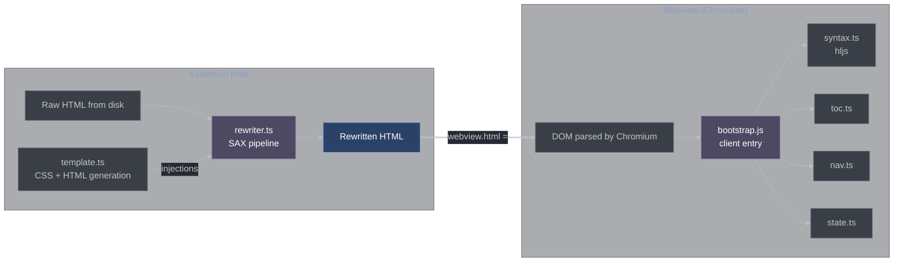
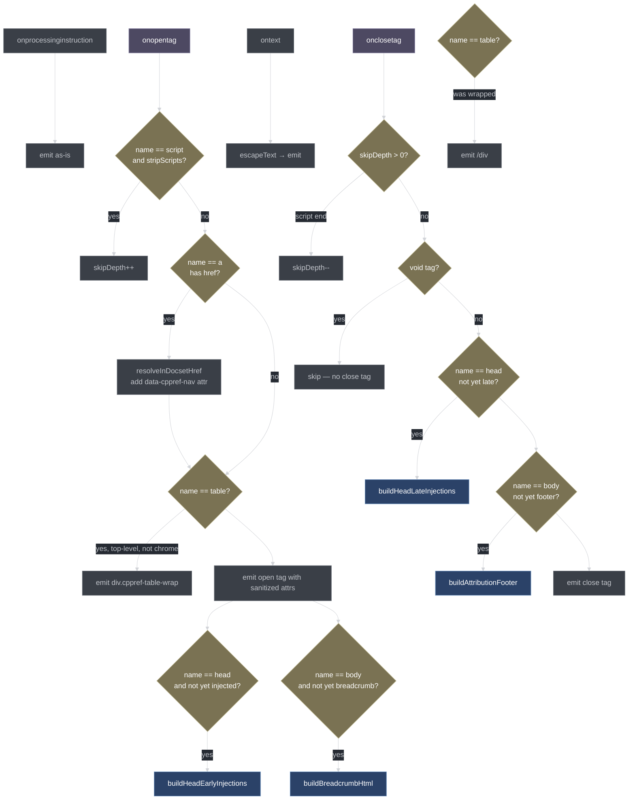
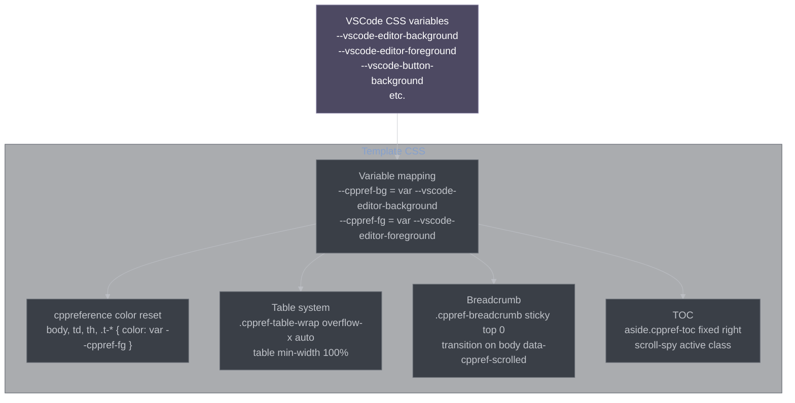
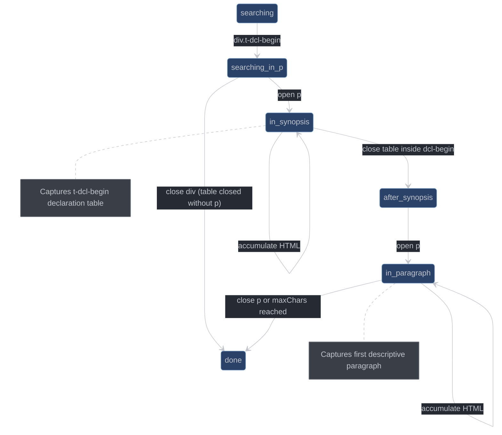
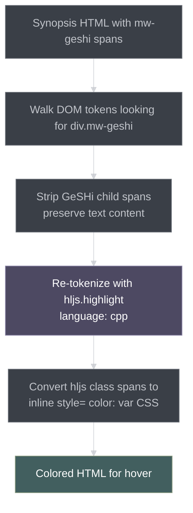
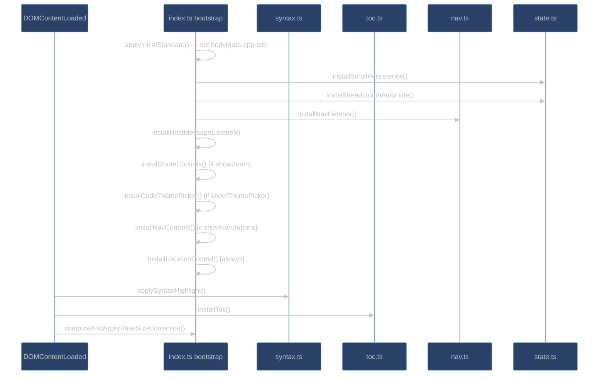
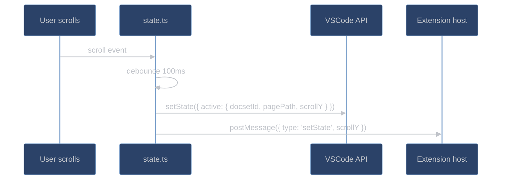

# Rendering Pipeline

The rendering pipeline transforms raw cppreference HTML into a styled, interactive document that integrates seamlessly with the active VSCode theme. This involves two passes: a host-side SAX rewrite (extension host process) and a client-side bootstrap (webview Chromium process).

## Overview



## Host-Side Rewriter

[src/webview-host/rewriter.ts](src/webview-host/rewriter.ts) — SAX-based streaming HTML transformer using `htmlparser2`.

### Injection Points

```
<html>
  <head>
    ← EARLY HEAD (injected as first children)
       • <meta http-equiv="Content-Security-Policy" ...>
       • <base href="...">
       • <script>window.__cppref = { bootstrapData }</script>
       • <script nonce="..." src="bootstrap.js"></script>

    [cppreference original <link rel="stylesheet"> tags]

    ← LATE HEAD (injected as last children, BEFORE </head>)
       • <style>  VSCode theme CSS vars + reset + table system  </style>
       • <style id="cppref-code-theme-vars">  base16 code theme vars  </style>
       • <style>  C++ standard filter CSS  </style>
  </head>
  <body>
    ← BREADCRUMB (injected as first child of <body>)
       • <nav class="cppref-breadcrumb">cpp / container / vector</nav>

    [cppreference content]

    ← ATTRIBUTION FOOTER (injected before </body>)
       • CC BY-SA 3.0 + GFDL notice
  </body>
</html>
```

**Why EARLY + LATE head split?** The CSP `<meta>` and `<base href>` must come first so they apply to everything that follows. But the theme `<style>` must come *after* cppreference's own `<link rel="stylesheet">` so our VSCode-variable-bound rules win at equal specificity via source order. A single injection point can't satisfy both constraints.

### SAX Pipeline Handlers



### Inline Style Sanitization

`sanitizeInlineStyle(value)` strips CSS properties that would override the VSCode theme:

**Dropped properties:** `background`, `background-color`, `background-image`, `color`, `border`, `border-color`, `border-top-color`, `border-right-color`, `border-bottom-color`, `border-left-color`

**Kept properties:** `width`, `height`, `padding`, `margin`, `text-align`, `vertical-align`, `display`, and all other layout properties.

The `bgcolor` HTML attribute is also dropped entirely (it bypasses CSS cascade).

### In-Docset Link Rewriting

For every `<a href>` tag, `resolveInDocsetHref()` checks if the href points to another page within the same docset. If so, it computes the docset-relative `pagePath` and stores it as `data-cppref-nav`:

```html
<!-- Before rewrite -->
<a href="../memory/allocator.html">std::allocator</a>

<!-- After rewrite -->
<a href="../memory/allocator.html" data-cppref-nav="en/cpp/memory/allocator.html">
  std::allocator
</a>
```

The client-side click interceptor reads `data-cppref-nav` directly — no URL parsing needed at click time. This avoids the fragile webview-URI string matching that was used previously.

### Table Wrapping

Top-level content tables are wrapped in `<div class="cppref-table-wrap">` to enable horizontal scroll inside the container instead of on the entire page:

```html
<!-- Before -->
<table class="t-dsc-begin">...</table>

<!-- After -->
<div class="cppref-table-wrap">
  <table class="t-dsc-begin">...</table>
</div>
```

Chrome tables (`t-navbar-head`, `t-navbar-menu`, `t-navbar`, `t-noprint`) are excluded because wrapping them breaks dropdown menu positioning.

Nested tables are not wrapped — only depth-0 tables get their own container.

## Template Generation

[src/webview-host/template.ts](src/webview-host/template.ts) — CSS and HTML generation for all injected content.

### TemplateContext

```typescript
interface TemplateContext {
    webview: Webview;           // for webview.asWebviewUri()
    nonce: string;              // CSP script nonce
    bootstrapUri: Uri;          // webview URI to bootstrap.js
    baseHref: string;           // page directory URL (for relative assets)
    docsetWebviewBase: string;  // documents root URL
    scrollTarget: ScrollTarget; // { anchor: 'id' } or {}
    cppStandard: CppStdToken;   // 'cxx11' | 'cxx14' | ... | 'cxx26'
    codeTheme: CodeTheme;       // selected base16 theme
    showZoom: boolean;
    showThemePicker: boolean;
    showNavButtons: boolean;
    zoomFactor: number;
}
```

### `buildHeadEarlyInjections(ctx)`

Produces:
1. **CSP `<meta>`** — `default-src 'none'; script-src 'nonce-${ctx.nonce}'; style-src 'unsafe-inline' ${cspSource}; img-src ${cspSource} data: https:; font-src ${cspSource} data:`
2. **`<base href>`** — resolves relative URLs in cppreference HTML (CSS, images, internal links) against the page's directory.
3. **Bootstrap data `<script>`** — `window.__cppref = { ... }` inline script (nonce-gated) with the `TemplateContext` fields needed by the client.
4. **Bootstrap `<script src>`** — loads `bootstrap.js` (nonce-gated).

### `buildHeadLateInjections(ctx)`

Produces:
1. **Theme `<style>`** — ~1500 lines of CSS generated by `buildThemeStyleBlock()`. Maps VSCode CSS variables (`--vscode-editor-background`, `--vscode-editor-foreground`, etc.) to cppreference DOM elements. Includes a complete reset for cppreference's own colors and a responsive table system.
2. **Code theme `<style id="cppref-code-theme-vars">`** — base16 palette mapped to `--cppref-hljs-*` CSS custom properties. The stable `id` attribute allows live theme swapping by replacing just this element.
3. **Standard filter `<style>`** — CSS rules that show/hide `.t-since-cxxN` / `.t-until-cxxN` elements based on `body[data-cpp-std]`.

### Theme CSS Architecture



### Breadcrumb Generation

`buildBreadcrumbHtml({ pagePath, cppStandard })` converts a docset-relative path like `cpp/container/vector` into a linked breadcrumb trail:

```html
<nav class="cppref-breadcrumb" aria-label="Documentation path">
  <ol>
    <li><a href="..." data-cppref-nav="en/cpp/index.html">cpp</a></li>
    <li><a href="..." data-cppref-nav="en/cpp/container/index.html">container</a></li>
    <li><span>vector</span></li>  <!-- last segment: no link -->
  </ol>
</nav>
```

The breadcrumb is sticky and auto-hides on scroll (at 4px threshold) via `body[data-cppref-scrolled="1"]` which is toggled by the client's `installBreadcrumbAutoHide()`.

## Snippet Extraction

[src/webview-host/snippet.ts](src/webview-host/snippet.ts)

`extractSnippet(html, maxChars)` uses a finite-state machine to extract the declaration synopsis and first paragraph from a cppreference page, for use in hover previews.



**Text budget:** The `maxChars` limit applies to extracted text content (not HTML). When the budget is hit mid-tag, the FSM closes any open tags to preserve valid HTML structure rather than truncating abruptly.

**Stripped tags:** `<script>`, `<style>`, `<iframe>`, `<button>`, `<form>`, `<input>` — interactive elements have no meaning in a hover tooltip.

**Returns:**
```typescript
interface ExtractedSnippet {
    synopsis: string | undefined;   // HTML for the t-dcl-begin table
    intro: string | undefined;      // HTML for the first paragraph
}
```

### Snippet Cache

[src/webview-host/snippet-cache.ts](src/webview-host/snippet-cache.ts)

LRU cache for extracted snippets, capacity 64. Key: `"${filePath}|${mtimeMs}|${maxChars}"`.

The `mtimeMs` component provides automatic invalidation: if a cppreference reinstall rewrites the HTML file, the modified timestamp changes and the old cache entry is naturally evicted by the LRU policy.

## Hover Highlight

[src/webview-host/hover-highlight.ts](src/webview-host/hover-highlight.ts)

`highlightSynopsisHtml(html)` performs server-side syntax highlighting for the hover preview. This converts cppreference's GeSHi markup to highlight.js-colored spans.



**HLJS_COLORS map** maps highlight.js class names to VSCode CSS variable references with hex fallbacks:

```typescript
const HLJS_COLORS: Record<string, string> = {
    'hljs-keyword': 'var(--vscode-editorInfo-foreground, #569cd6)',
    'hljs-string': 'var(--vscode-debugTokenExpression-string, #ce9178)',
    'hljs-number': 'var(--vscode-debugTokenExpression-number, #b5cea8)',
    'hljs-comment': 'var(--vscode-editorLineNumber-foreground, #6a9955)',
    // ... 15+ entries
};
```

Using VSCode CSS variables means the hover preview colors track the active theme, matching the webview's colors.

## Client Bootstrap

[src/webview-client/index.ts](src/webview-client/index.ts)

The browser IIFE bundle entry point. Reads `window.__cppref` (injected by the host) and wires up all client subsystems.



**`computeAndApplyBaseSizeCorrection()`** adjusts the base font size to compensate for VSCode's webview default font-size setting, ensuring text renders at the expected size regardless of the user's VSCode font preference.

## Client: Syntax Highlighting

[src/webview-client/syntax.ts](src/webview-client/syntax.ts)

`applySyntaxHighlight()` re-tokenizes code blocks with highlight.js to produce consistent, theme-aware syntax colors.

**Target selectors:**
- `div.mw-geshi` — cppreference's GeSHi-highlighted code blocks
- `pre.source-cpp` — pre-colored C++ blocks
- `pre.source-c` — pre-colored C blocks

**Filtering:** Only blocks that are multiline OR longer than 30 characters with whitespace are highlighted. Inline code snippets (like identifiers in prose) are skipped.

**Language detection:** CSS class names on the container are parsed: `source-cpp` → `cpp`, `source-c` → `c`. If both are present, `cpp` wins.

**Idempotency:** Processed blocks receive `data-cppref-hljs="1"`. Calling `applySyntaxHighlight()` twice won't double-process a block.

**Output structure:**
```html
<pre class="cppref-hljs-pre">
  <code class="hljs language-cpp">
    <!-- hljs-tokenized spans -->
  </code>
</pre>
```

## Client: Table of Contents

[src/webview-client/toc.ts](src/webview-client/toc.ts)

`installToc()` builds a floating sidebar TOC from heading elements.

**Requirements:**
- At least 3 headings with `id` attributes required (otherwise TOC is skipped).
- Processes `h2[id]` and `h3[id]` elements.

**Structure:**
```html
<aside class="cppref-toc">
  <nav>
    <ul>
      <li class="toc-h2"><a href="#declarations">Declarations ¶</a></li>
      <li class="toc-h3"><a href="#notes">Notes ¶</a></li>
    </ul>
  </nav>
</aside>
```

**Pilcrow anchors:** Each heading gets a `¶` symbol appended as a clipboard-copy button. Clicking copies `location.href + '#' + heading.id` to the clipboard.

**Scroll-spy via IntersectionObserver:**
```typescript
new IntersectionObserver(entries => {
    for (const entry of entries) {
        if (entry.isIntersecting) {
            // mark corresponding TOC link as active
        }
    }
}, { rootMargin: '-10% 0px -70% 0px' });
```

The `rootMargin` of `-10% 0px -70% 0px` means a heading is considered "active" when it's in the upper 20% of the viewport, providing natural reading-position tracking.

## Client: Navigation

[src/webview-client/nav.ts](src/webview-client/nav.ts)

`classifyClick(event, docsetWebviewBase)` is a pure function that determines how to handle a click:

| Classification | Condition                                                                      | Action                              |
| -------------- | ------------------------------------------------------------------------------ | ----------------------------------- |
| `skip`         | Not an `<a>` click, or `.cppref-no-intercept` class, or `data-cppref-external` | Default browser behavior            |
| `anchor`       | `href` starts with `#`                                                         | Scroll to anchor in current page    |
| `nav`          | `data-cppref-nav` present, or href resolves within `docsetWebviewBase`         | Post `nav` message to host          |
| `external`     | All other hrefs                                                                | Post `openExternal` message to host |

**Fast path:** If the rewriter already computed `data-cppref-nav`, the click handler uses it directly without any URL parsing. The URL-based fallback handles links the rewriter couldn't pre-compute (edge cases, dynamically generated content).

Every click classification is reported back to the host via a diagnostic `click` message for observability.

## Client: Scroll and State

[src/webview-client/state.ts](src/webview-client/state.ts)

### Scroll Persistence



`history.scrollRestoration = 'manual'` is set at startup to prevent Chromium from auto-restoring scroll positions when the webview HTML is replaced by the host.

### Scroll Target Application

`applyScrollTarget()` uses a two-pass approach:
1. **Immediate** (on DOMContentLoaded) — call `scrollIntoView()` or `scrollTo(0,0)`.
2. **rAF follow-up** — call again after the first layout+paint.

The second pass is necessary because Chromium's deferred scroll-restoration can run between DOMContentLoaded and the first paint and silently undo the initial `scrollTo(0,0)`. The rAF fires after the first paint, overriding Chromium's restoration.

### Breadcrumb Auto-Hide

`installBreadcrumbAutoHide()` sets `body[data-cppref-scrolled="0|1"]` based on scroll position (threshold: 4px). The CSS uses this attribute to slide the breadcrumb off-screen when scrolled:

```css
.cppref-breadcrumb {
    transform: translateY(0);
    transition: transform 0.2s ease;
}
body[data-cppref-scrolled="1"] .cppref-breadcrumb {
    transform: translateY(-100%);
}
```

## Client: Code Theme Picker

[src/webview-client/code-theme.ts](src/webview-client/code-theme.ts)

`installCodeThemePicker()` builds a `<select>` element with `<optgroup>` for Dark and Light themes. On change, posts `pickCodeTheme` to the host.

`handleSetCodeTheme(themeId)` receives the `setCodeTheme` host message and replaces the content of `<style id="cppref-code-theme-vars">` with the new CSS variable block — a live theme swap without page reload.

The element ID `"cppref-code-theme-vars"` is stable and defined in both the template (where the `<style>` is initially injected) and the client (where it's replaced on theme change).
