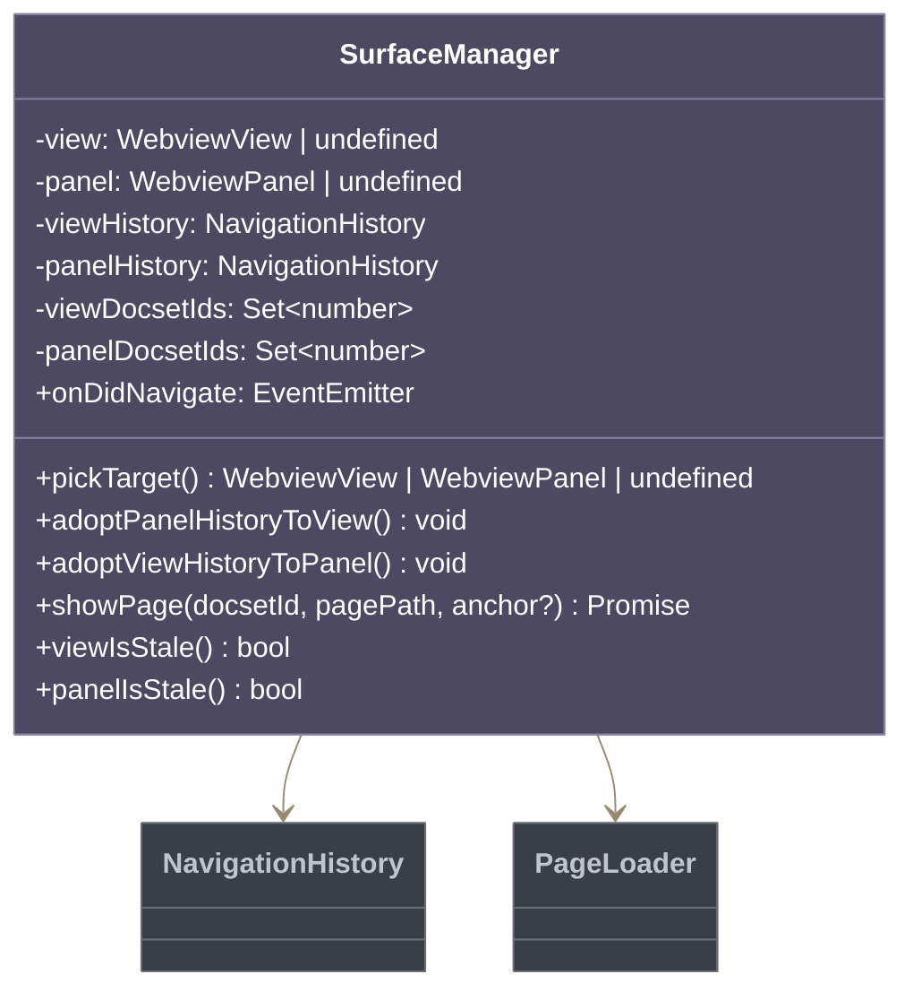
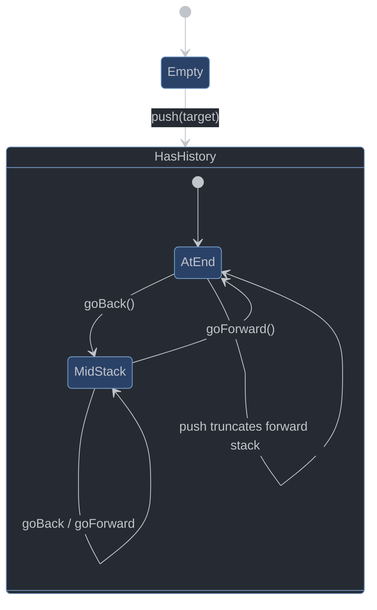
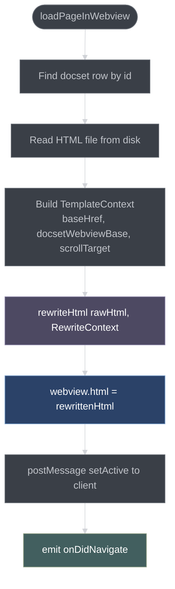
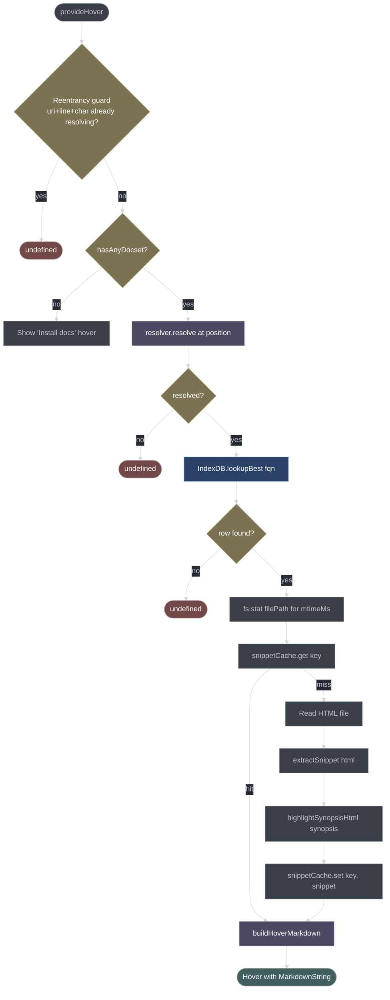
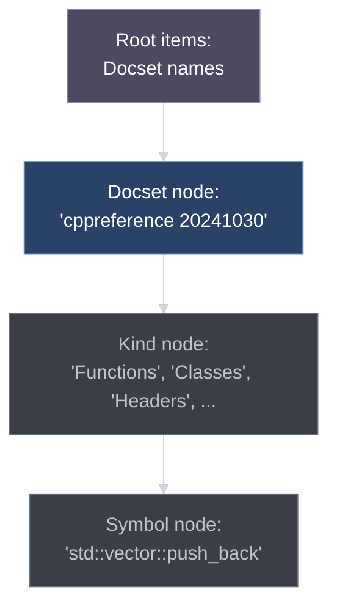
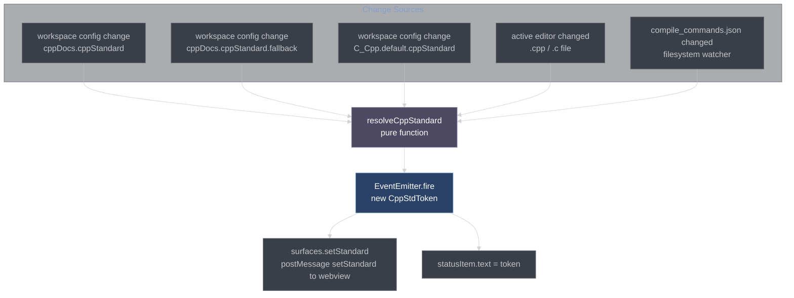
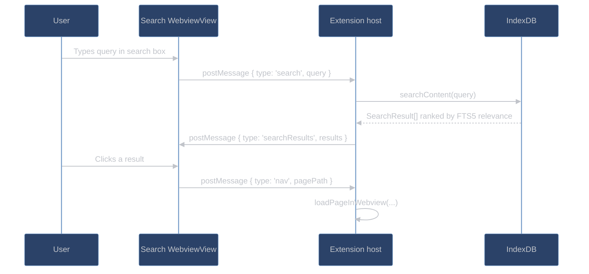

# UI Layer

The UI layer encompasses everything visible to the user: the documentation panel (WebviewView or WebviewPanel), the hover provider, the symbol tree, the search view, and the surface management infrastructure.

## Surface Manager

[src/ui/surface/manager.ts](src/ui/surface/manager.ts)

The `SurfaceManager` enforces the **single-instance invariant**: only one webview surface (either the sidebar `WebviewView` or an editor `WebviewPanel`) is active at any time.



**`pickTarget()`** returns whichever surface is currently registered (view or panel). If both somehow exist (transitional state during moves), the panel takes precedence.

**Staleness detection:** When new docsets are installed after a surface was created, `viewIsStale()` / `panelIsStale()` return `true` (the set of docset IDs registered with the surface doesn't match the current set). This triggers a reload prompt to the user so the new docset becomes available without restarting VSCode.

**History adoption:** When the user moves the panel from sidebar to editor (or vice versa), `adoptPanelHistoryToView()` / `adoptViewHistoryToPanel()` transfer the navigation stack so back/forward continuity is maintained across moves.

**`onDidNavigate` event:** Fired after every successful page load. Used by the symbol TreeView to reveal the tree node corresponding to the currently-shown page.

## Navigation History

[src/ui/surface/navigation.ts](src/ui/surface/navigation.ts)

Browser-style back/forward navigation stack. Cap: 50 entries.



```typescript
interface NavTarget {
    docsetId: number;
    pagePath: string;
    anchor?: string;
}

class NavigationHistory {
    push(target: NavTarget): void
    goBack(): NavTarget | undefined
    goForward(): NavTarget | undefined
    canGoBack(): boolean
    canGoForward(): boolean
    current(): NavTarget | undefined
}
```

`push()` truncates the forward stack (entries after the current position) before appending the new target — standard browser behavior. Pressing Back after navigating to a new page discards the forward history.

**`hrefToTarget(href, docsets)`** — resolves a clicked href to a `NavTarget` by matching against each docset's webview base URL. Returns `undefined` for external links.

## Page Loader

[src/ui/surface/page-loader.ts](src/ui/surface/page-loader.ts)

`loadPageInWebview(webview, docsetId, pagePath, anchor?, loaderDeps?)` is the main rendering function called by `SurfaceManager.showPage()`.



### Placeholder Renderers

When no docset page is available, specialized placeholder pages are rendered using `renderShellHtml()` from `shared.ts`:

| Function                          | When                                  | Content                          |
| --------------------------------- | ------------------------------------- | -------------------------------- |
| `renderEmptyPage()`               | After `clearPanel` on miss            | Blank page                       |
| `renderMissPlaceholder(fqn)`      | Symbol not in index                   | "No docs for X" with search link |
| `renderReloadPlaceholder()`       | After docset install while panel open | "Click to reload" button         |
| `renderNotInstalledPlaceholder()` | No docsets at all                     | "Install cppreference" CTA       |

Placeholders use the same `buildHeadLateInjections()` + theme CSS as real pages, so they inherit the VSCode theme colors.

### Navigation Resolution

`resolveNavHref(webview, href, docsets)` → called by the click interceptor when `data-cppref-nav` is not present. Parses the href URI and compares against docset webview base URIs.

`resolveNavHrefByPagePath(docsets, pagePath, anchor?)` → called with a `data-cppref-nav` value. Direct docset-relative path lookup.

`resolveNavHrefByPath(docsets, absolutePath)` → called for file-system-URI links (rare in cppreference pages).

## WebviewPanel Serializer

`src/ui/surface/serialize/` — Implements `WebviewPanelSerializer` which VSCode calls to restore an editor panel after an IDE restart.

```typescript
interface SerializedPanelState {
    docsetId: number;
    pagePath: string;
    scrollY?: number;
}
```

On `deserializeWebviewPanel(panel, state)`:
1. Validates the state shape (guards against schema mismatches from extension updates).
2. Calls `SurfaceManager.adoptPanel(panel)` to register the restored panel.
3. Calls `loadPageInWebview()` with the persisted `pagePath` and `scrollY` as `scrollTarget`.

The state is kept in sync by the client's `setActive` message (host posts it after every `loadPageInWebview()`, client echoes back with current `scrollY`).

## Hover Provider

[src/ui/hover-provider.ts](src/ui/hover-provider.ts)

`CppDocsHoverProvider` implements `vscode.HoverProvider`. Registered for `cpp`, `c`, `cuda-cpp`, `objective-c`, `objective-cpp`.



### Reentrancy Guard

The reentrancy guard (`resolving: Set<string>`) prevents infinite recursion. The hover-parser resolver strategy calls `vscode.executeHoverProvider`, which re-triggers `CppDocsHoverProvider.provideHover()`. Without the guard, this would recurse indefinitely.

Key: `"${uri.toString()}|${version}|${line}:${character}"` — same format as the resolver cache key.

### Hover Markdown Construction

`buildHoverMarkdown(row, snippet, fqn)` assembles the hover `MarkdownString`:

```markdown
**cppreference** · std::vector::push_back

```cpp
void push_back( const T& value );
void push_back( T&& value );
```

Appends the given element value to the end of the container...

[Open in docs panel](command:cppDocs.openPage?...) · [Search](command:cppDocs.search?...)
```

The `MarkdownString` is created with `isTrusted: { enabledCommands: ['cppDocs.openPage', 'cppDocs.search'] }` — a restricted trust mode that allows only those specific command links, not arbitrary commands. (Using `isTrusted: true` would allow any command, a security risk.)

The `HOVER_PROVENANCE_PREFIX = '**cppreference**'` constant identifies the hover as coming from this extension, helping users distinguish it from clangd's own hover or other providers.

## Symbol TreeView

The symbol tree is a standard VSCode `TreeDataProvider<TreeItem>` registered against the `cppDocs.docsetTree` view ID.



**Filter integration:** The tree view has a built-in filter box. User input is passed to `IndexDB.searchSymbolsForFilter(query)` which runs a `LIKE '%query%' COLLATE NOCASE` search. Results are shown flat (no kind grouping) when a filter is active.

**Tree reveal sync:** `SurfaceManager.onDidNavigate` fires after each page load. The tree provider handles this event by calling `treeView.reveal(node)` for the symbol node corresponding to the current page.

## C++ Standard Manager

[src/ui/cpp-standard-manager.ts](src/ui/cpp-standard-manager.ts)

`CppStandardManager` tracks the current C++ standard and notifies subscribers when it changes.



**`resolveCppStandard()`** priority chain:
1. `cppDocs.cppStandard` explicit setting (highest priority)
2. `C_Cpp.default.cppStandard` from the C/C++ extension
3. Active file's `compile_commands.json` entry (`-std=c++20` flags parsed by `parseStdFromCmd()`)
4. `cppDocs.cppStandard.fallback` setting
5. `'cxx17'` hard default

**`parseStdFromCompileDb(filePath)`** reads `compile_commands.json`, finds the entry for the current file, and extracts the `-std=` flag. Cached per file path to avoid re-parsing on every cursor movement.

## C++ Standard Filtering CSS

[src/ui/cpp-standard.ts](src/ui/cpp-standard.ts)

`buildAllStandardFiltersCss(token)` generates CSS that shows only the API elements available in the selected standard:

```css
/* For cxx17: */
body[data-cpp-std="cxx17"] .t-until-cxx17 { display: none !important; }
body[data-cpp-std="cxx17"] .t-since-cxx20 { display: none !important; }
body[data-cpp-std="cxx17"] .t-since-cxx23 { display: none !important; }
body[data-cpp-std="cxx17"] .t-since-cxx26 { display: none !important; }
/* Elements available in cxx17 and below remain visible */
body[data-cpp-std="cxx17"] .t-since-cxx11 { display: block !important; }
body[data-cpp-std="cxx17"] .t-since-cxx14 { display: block !important; }
body[data-cpp-std="cxx17"] .t-since-cxx17 { display: block !important; }
```

`buildStandardFilterCssFor(token)` generates rules for a single standard, `buildAllStandardFiltersCss()` generates for all standards (the full block is injected once; only the active `body[data-cpp-std]` attribute value matters at render time).

`settingToToken()` / `tokenToSetting()` convert between the config string format (`"C++17"`, `"c++20"`) and the internal token format (`"cxx17"`, `"cxx20"`).

`parseStdFromCmd(flagString)` parses `-std=c++20`, `-std=gnu++17`, `-std=c17`, etc. from compile command strings.

## Search View

The search view is a `WebviewView` registered as `cppDocs.searchView` (shown only when `hasDocsets`). It provides full-text search across all installed documentation.



Results are ranked by FTS5's built-in relevance scoring (BM25 with Porter stemming). The top 20 results are returned.

## Status Bar Item

A `StatusBarItem` in the bottom status bar shows the active C++ standard (e.g., `C++17`). Clicking it runs `cppDocs.selectStandard` to open a quick-pick for standard selection.

When no docsets are installed, the status bar item shows a `$(cloud-download)` icon with an "Install" label. Clicking it runs `cppDocs.install`.
