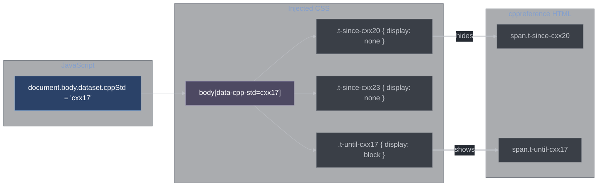

# Configuration

All user-configurable settings live under the `cppDocs` namespace in VSCode settings. This document covers every setting, their default values, and how they interact.

## Settings Reference

### Installation

| Setting                          | Type             | Default         | Description                                                                                                             |
| -------------------------------- | ---------------- | --------------- | ----------------------------------------------------------------------------------------------------------------------- |
| `cppDocs.cppreference.pinnedTag` | `string \| null` | `null`          | Pin to a specific cppreference release tag (e.g. `"20241030"`). If null, the latest release is used.                    |
| `cppDocs.docsetStoragePath`      | `string`         | OS app-data dir | Override the directory where docsets and the index DB are stored. Useful for shared network drives or custom locations. |

The default `docsetStoragePath` is:
- **macOS**: `~/Library/Application Support/Code/User/globalStorage/orlac.cpp-docs/`
- **Linux**: `~/.config/Code/User/globalStorage/orlac.cpp-docs/`
- **Windows**: `%APPDATA%\Code\User\globalStorage\orlac.cpp-docs\`

### C++ Standard

| Setting                        | Type           | Default   | Description                                                                                                                       |
| ------------------------------ | -------------- | --------- | --------------------------------------------------------------------------------------------------------------------------------- |
| `cppDocs.cppStandard`          | `enum \| null` | `null`    | Explicit C++ standard override. Values: `"C++11"`, `"C++14"`, `"C++17"`, `"C++20"`, `"C++23"`, `"C++26"`. If null, auto-detected. |
| `cppDocs.cppStandard.fallback` | `enum`         | `"C++17"` | Used when auto-detection fails (no compile_commands.json, no C_Cpp.default.cppStandard).                                          |

**Auto-detection priority** (highest to lowest):
1. `cppDocs.cppStandard` (explicit override)
2. `C_Cpp.default.cppStandard` (from the Microsoft C/C++ extension)
3. `-std=` flag from `compile_commands.json` for the active file
4. `cppDocs.cppStandard.fallback`
5. `C++17` hardcoded default

### Panel Behavior

| Setting                           | Type                                   | Default     | Description                                                                                                           |
| --------------------------------- | -------------------------------------- | ----------- | --------------------------------------------------------------------------------------------------------------------- |
| `cppDocs.location`                | `"sidebar" \| "editor"`                | `"sidebar"` | Where the docs panel appears. `sidebar` = WebviewView in secondary sidebar. `editor` = WebviewPanel as an editor tab. |
| `cppDocs.followCursor`            | `boolean`                              | `true`      | Automatically show docs for the symbol under the cursor as it moves.                                                  |
| `cppDocs.onMissBehavior`          | `"stay" \| "showLink" \| "clearPanel"` | `"stay"`    | What to do when cursor-follow can't resolve a symbol.                                                                 |
| `cppDocs.followCursor.debounceMs` | `number`                               | `300`       | Milliseconds to wait after cursor stops moving before resolving. Lower = more responsive but more CPU.                |

**`onMissBehavior` options:**
- `stay` — Keep the current page visible. Useful when cursor frequently passes over unresolvable tokens (e.g. operators, literals).
- `showLink` — Show a hover tooltip with a link to search for the token. Helpful for discovery.
- `clearPanel` — Replace the panel with an empty page. Cleanest visual, but causes flicker.

### Zoom

| Setting                | Type      | Default | Description                                       |
| ---------------------- | --------- | ------- | ------------------------------------------------- |
| `cppDocs.zoom.enabled` | `boolean` | `true`  | Show zoom controls in the docs panel.             |
| `cppDocs.zoom.factor`  | `number`  | `1.0`   | Initial zoom factor (1.0 = 100%). Range: 0.5–3.0. |

Zoom is applied via the `--cppref-zoom` CSS custom property on `<html>`, which scales `font-size`. Panel controls are `+` / `-` / `reset` buttons.

### Code Themes

| Setting                            | Type      | Default    | Description                                                                              |
| ---------------------------------- | --------- | ---------- | ---------------------------------------------------------------------------------------- |
| `cppDocs.codeTheme`                | `string`  | `"hybrid"` | ID of the selected code theme. See theme IDs in [Code Theme System](#code-theme-system). |
| `cppDocs.codeTheme.picker.enabled` | `boolean` | `true`     | Show the theme picker `<select>` in the docs panel.                                      |

### Navigation UI

| Setting                      | Type      | Default | Description                                             |
| ---------------------------- | --------- | ------- | ------------------------------------------------------- |
| `cppDocs.navButtons.enabled` | `boolean` | `true`  | Show back/forward navigation buttons in the docs panel. |

### Symbol Tree

| Setting                | Type      | Default | Description                               |
| ---------------------- | --------- | ------- | ----------------------------------------- |
| `cppDocs.tree.enabled` | `boolean` | `true`  | Show the symbol tree view in the sidebar. |

### Resolver

| Setting                          | Type      | Default | Description                                                                                                                |
| -------------------------------- | --------- | ------- | -------------------------------------------------------------------------------------------------------------------------- |
| `cppDocs.resolver.timeoutMs`     | `number`  | `2000`  | Per-strategy resolver timeout in milliseconds. If a strategy doesn't respond within this time, the next strategy is tried. |
| `cppDocs.resolver.disableClangd` | `boolean` | `false` | Skip the clangd-bridge strategy entirely. Useful if clangd is slow to start or unavailable.                                |

### Logging

| Setting                   | Type      | Default | Description                                                 |
| ------------------------- | --------- | ------- | ----------------------------------------------------------- |
| `cppDocs.logging.enabled` | `boolean` | `false` | Enable structured logging to the "C++ Docs" output channel. |

## Code Theme System

[src/webview-host/code-themes.ts](src/webview-host/code-themes.ts)

The code theme system uses the **Base16** color standard: 16 color slots (`base00`–`base0F`) that define a complete syntax highlighting palette.

```
base00  Background
base01  Lighter background (selection, highlights)
base02  Even lighter background (line highlights)
base03  Comments, invisibles
base04  Dark foreground (status bars)
base05  Default foreground
base06  Light foreground
base07  Light background
base08  Variables, constants, errors      → red family
base09  Integers, floats, preprocessing   → orange family
base0A  Classes, markup bold             → yellow family
base0B  Strings, markup code            → green family
base0C  Regex, escape chars             → cyan family
base0D  Functions, headings             → blue family
base0E  Keywords, storage, selectors    → purple family
base0F  Deprecated, special             → brown family
```

### Available Themes

**Dark (15 themes):**

| ID                 | Name             |
| ------------------ | ---------------- |
| `hybrid`           | Hybrid           |
| `dracula`          | Dracula          |
| `monokai`          | Monokai          |
| `one-dark`         | One Dark         |
| `nord`             | Nord             |
| `tokyo-night-dark` | Tokyo Night Dark |
| `catppuccin-mocha` | Catppuccin Mocha |
| `gruvbox-dark`     | Gruvbox Dark     |
| `material-darker`  | Material Darker  |
| `solarized-dark`   | Solarized Dark   |
| `tomorrow-night`   | Tomorrow Night   |
| `ocean`            | Ocean            |
| `eighties`         | Eighties         |
| `railscasts`       | Railscasts       |
| `twilight`         | Twilight         |

**Light (15 themes):**

| ID                   | Name               |
| -------------------- | ------------------ |
| `github-light`       | GitHub Light       |
| `solarized-light`    | Solarized Light    |
| `one-light`          | One Light          |
| `catppuccin-latte`   | Catppuccin Latte   |
| `gruvbox-light`      | Gruvbox Light      |
| `material-lighter`   | Material Lighter   |
| `tomorrow-day`       | Tomorrow Day       |
| `atelier-cave-light` | Atelier Cave Light |
| `mexico-light`       | Mexico Light       |
| `papercolor-light`   | PaperColor Light   |
| `default-light`      | Default Light      |
| `harmonic-light`     | Harmonic Light     |
| `humanoid-light`     | Humanoid Light     |
| `shapeshifter`       | Shapeshifter       |
| `summerfruit-light`  | Summerfruit Light  |

### Theme Application

`buildCodeThemeCssVars(theme)` generates CSS custom properties from the theme's base16 palette:

```css
:root {
    --cppref-hljs-base00: #1d1f21;  /* background */
    --cppref-hljs-base01: #282a2e;
    --cppref-hljs-base02: #373b41;
    --cppref-hljs-base03: #969896;  /* comments */
    --cppref-hljs-base04: #b4b7b4;
    --cppref-hljs-base05: #c5c8c6;  /* foreground */
    --cppref-hljs-base06: #e8e8d3;
    --cppref-hljs-base07: #ffffff;
    --cppref-hljs-base08: #cc6666;  /* variables/errors */
    --cppref-hljs-base09: #de935f;  /* integers */
    --cppref-hljs-base0A: #f0c674;  /* classes */
    --cppref-hljs-base0B: #b5bd68;  /* strings */
    --cppref-hljs-base0C: #8abeb7;  /* regex */
    --cppref-hljs-base0D: #81a2be;  /* functions */
    --cppref-hljs-base0E: #b294bb;  /* keywords */
    --cppref-hljs-base0F: #a3685a;  /* deprecated */
}
```

The hljs token classes map to these variables:
```css
.hljs-keyword   { color: var(--cppref-hljs-base0E); }
.hljs-string    { color: var(--cppref-hljs-base0B); }
.hljs-number    { color: var(--cppref-hljs-base09); }
.hljs-comment   { color: var(--cppref-hljs-base03); }
.hljs-function  { color: var(--cppref-hljs-base0D); }
/* ... */
```

**Live swap:** When the user selects a different theme, the host posts a `setCodeTheme` message. The client replaces the content of `<style id="cppref-code-theme-vars">` — no page reload needed.

### `getCodeThemeMenuEntries()`

Returns `{ id, label, kind }[]` — note that `palette` is excluded from menu entries to keep the bootstrap payload small. The full palette is only included in the `loadPage` host message when a page is first rendered.

`getCodeTheme(id)` returns the theme by ID, falling back to `'hybrid'` if the ID is unknown. This ensures that if a user has a now-removed theme in their settings, the extension still renders correctly.

## C++ Standard Filter CSS Architecture



cppreference marks version-specific content with CSS classes like `t-since-cxx20` (visible in C++20+) and `t-until-cxx17` (visible until C++17). The filter CSS uses attribute selectors on `body[data-cpp-std]` to show/hide these elements.

The full CSS block for all supported standards is generated once by `buildAllStandardFiltersCss()` and injected as a single `<style>` in the late head injections. Only the `data-cpp-std` attribute needs to change when the user selects a different standard — the CSS handles the rest.

## Commands

21 commands are registered in `extension.ts`. All use the `cppDocs.` prefix.

| Command ID                   | Title                      | When             |
| ---------------------------- | -------------------------- | ---------------- |
| `cppDocs.install`            | Install cppreference       | Always           |
| `cppDocs.remove`             | Remove Docset              | hasDocsets       |
| `cppDocs.openPage`           | Open page in docs panel    | Always           |
| `cppDocs.search`             | Search documentation       | hasDocsets       |
| `cppDocs.goBack`             | Navigate back              | hasDocsets       |
| `cppDocs.goForward`          | Navigate forward           | hasDocsets       |
| `cppDocs.selectStandard`     | Select C++ standard        | Always           |
| `cppDocs.toggleFollowCursor` | Toggle cursor follow       | Always           |
| `cppDocs.setOnMissBehavior`  | Set on-miss behavior       | Always           |
| `cppDocs.showOutput`         | Show output channel        | Always           |
| `cppDocs.setCodeTheme`       | Change code theme          | hasDocsets       |
| `cppDocs.zoomIn`             | Zoom in                    | hasDocsets       |
| `cppDocs.zoomOut`            | Zoom out                   | hasDocsets       |
| `cppDocs.zoomReset`          | Reset zoom                 | hasDocsets       |
| `cppDocs.moveToSidebar`      | Move panel to sidebar      | panel is editor  |
| `cppDocs.moveToEditor`       | Move panel to editor       | panel is sidebar |
| `cppDocs.reloadDocset`       | Reload docset              | hasDocsets       |
| `cppDocs.checkUpdate`        | Check for updates          | hasDocsets       |
| `cppDocs.openExternal`       | Open in browser            | hasDocsets       |

## View Containers and Views

Declared in `package.json` contributions:

**Activity bar container:** `cppDocsetsBrowser`
- Icon: `media/icons/cpp-docset-library.svg`

**Secondary sidebar container:** `cppDocsViewerPanel`
- Icon: `media/icons/cpp-docs-viewer.svg`

**Views:**
| View ID              | Type    | Container            | When                           |
| -------------------- | ------- | -------------------- | ------------------------------ |
| `cppDocs.searchView` | webview | `cppDocsetsBrowser`  | `hasDocsets`                   |
| `cppDocs.docsetTree` | tree    | `cppDocsetsBrowser`  | `config.cppDocs.tree.enabled`  |
| `cppDocs.docPanel`   | webview | `cppDocsViewerPanel` | `cppDocs.location != 'editor'` |
