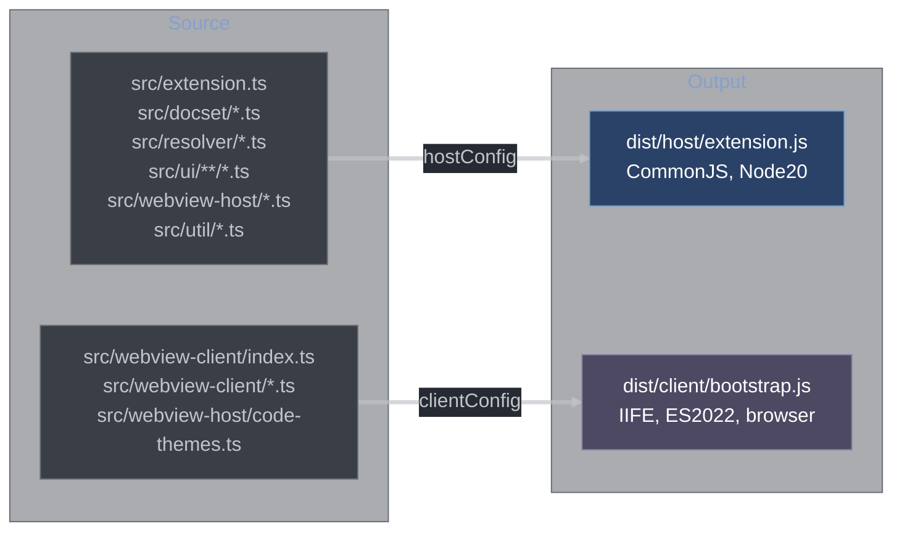

# Build and Testing

## Build System

The extension uses **esbuild** for fast bundling with a dual-target configuration: one bundle for the Node.js extension host and one for the browser webview.

### Dual-Bundle Architecture

[esbuild.mjs](esbuild.mjs) defines two independent build configs:



#### Host Bundle (`hostConfig`)

```javascript
{
    entryPoints: ['src/extension.ts'],
    bundle: true,
    platform: 'node',
    format: 'cjs',          // CommonJS for VSCode extension host
    target: 'node20',
    outfile: 'dist/host/extension.js',
    external: [
        'vscode',
        '@sqlite.org/sqlite-wasm',
        'lzma-native',
        'tar',
        'node-stream-zip',
        'plist',
        'saxes'
    ]
}
```

**Why external?** These packages are either:
- **`vscode`** — provided by the runtime, must not be bundled.
- **`@sqlite.org/sqlite-wasm`** — ships its own WASM binary; bundling it would corrupt the binary or break the WASM loading path.
- **`lzma-native`** / **`tar`** / **`node-stream-zip`** — native addons or packages with complex binary/stream behavior that esbuild can't safely inline.
- **`plist`** / **`saxes`** — pure JS but kept external to reduce bundle size (included in `node_modules` at runtime).

External packages are listed in `bundledDependencies` in `package.json` so they're included in the `.vsix` archive.

#### Client Bundle (`clientConfig`)

```javascript
{
    entryPoints: ['src/webview-client/index.ts'],
    bundle: true,
    platform: 'browser',
    format: 'iife',         // immediately-invoked for webview sandbox
    target: 'es2022',
    outfile: 'dist/client/bootstrap.js',
    // no externals — everything needed must be bundled
}
```

The client bundle includes `highlight.js` (client-side re-tokenization) and all `src/webview-client/*.ts` modules. `highlight.js` supports tree-shaking: only the C and C++ language grammars are imported.

**`es2022` target** — VSCode's embedded Chromium version supports modern ES features. `es2022` enables features like `at()`, top-level `await` (not used, but available), and `Object.hasOwn()`.

**IIFE format** — Webviews run in a CSP-restricted sandbox. An IIFE doesn't rely on module loaders or `require()`, which simplifies the CSP (no need to allow `script-src 'self'` module semantics).

### Build Scripts

```json
{
    "scripts": {
        "build": "node esbuild.mjs",
        "watch": "node esbuild.mjs --watch",
        "package": "vsce package",
        "lint": "eslint .",
        "typecheck": "tsc --noEmit",
        "test": "vitest run",
        "test:watch": "vitest"
    }
}
```

### TypeScript Configuration

Multiple `tsconfig` variants for different compilation contexts:

| File                   | Purpose        | Key Settings                                                                         |
| ---------------------- | -------------- | ------------------------------------------------------------------------------------ |
| `tsconfig.json`        | Base config    | `strict: true`, `moduleResolution: bundler`                                          |
| `tsconfig.host.json`   | Extension host | `lib: ["node20"]`, excludes `src/webview-client/`                                    |
| `tsconfig.client.json` | Webview client | `lib: ["ES2022", "DOM"]`, excludes `src/extension.ts` and docset/resolver/ui modules |
| `tsconfig.test.json`   | Unit tests     | Includes test files, `vitest/globals` types                                          |

The dual tsconfig setup is necessary because `src/webview-host/*.ts` modules are shared between the host (which imports them for `rewriteHtml`, `buildThemeStyleBlock`, etc.) and the client bundle (which imports `code-themes.ts` for the theme picker). The base tsconfig includes both, but the host and client configs exclude each other's environment-specific files.

## Testing

Tests use **Vitest** — a fast unit test runner compatible with the TypeScript source directly (no separate compile step for tests).

### Test Scope

Only pure functions with no VSCode API dependencies are unit tested. VSCode extension APIs (webview, workspace, commands) would require a VSCode integration test harness (`@vscode/test-cli`) which is not currently set up. The unit test suite covers the critical algorithmic components.

### Tested Modules

| Module                                   | What's tested                                                                                  |
| ---------------------------------------- | ---------------------------------------------------------------------------------------------- |
| `src/docset/cppreference-postprocess.ts` | `stripCppreferenceChrome(html)` — various chrome elements stripped correctly                   |
| `src/docset/update-check.ts`             | `compareCppreferenceVersions(a, b)` — lexicographic date comparison                            |
| `src/webview-host/snippet.ts`            | `extractSnippet(html, maxChars)` — FSM state transitions, text budget, HTML preservation       |
| `src/webview-host/rewriter.ts`           | `rewriteHtml(input, ctx)` — injection points, script stripping, link rewriting, table wrapping |
| `src/webview-host/hover-highlight.ts`    | `highlightSynopsisHtml(html)` — GeSHi strip + hljs token conversion                            |
| `src/resolver/hover-parser.ts`           | `normalizeFqn(raw)` — all normalization stages, operator special cases, ABI namespaces         |
| `src/resolver/definition-walker.ts`      | `parseDefinitionContext(...)` — scope detection, string/comment scrubbing                      |
| `src/resolver/fallback.ts`               | `buildFqnCandidates(...)` — candidate ordering                                                 |
| `src/ui/cpp-standard.ts`                 | `settingToToken()`, `tokenToSetting()`, `parseStdFromCmd()`, `buildStandardFilterCssFor()`     |
| `src/webview-host/snippet-cache.ts`      | `createSnippetCache(capacity)` — LRU eviction, recency update, capacity enforcement            |

### Running Tests

```bash
# Single run
npm test

# Watch mode (re-runs on file changes)
npm run test:watch

# With coverage
npx vitest run --coverage
```

### Test File Layout

```
src/
  docset/
    cppreference-postprocess.test.ts
    update-check.test.ts
  resolver/
    hover-parser.test.ts
    definition-walker.test.ts
    fallback.test.ts
  webview-host/
    snippet.test.ts
    snippet-cache.test.ts
    rewriter.test.ts
    hover-highlight.test.ts
  ui/
    cpp-standard.test.ts
```

### Example: `compareCppreferenceVersions` Tests

```typescript
describe('compareCppreferenceVersions', () => {
    it('returns positive when b is newer', () => {
        expect(compareCppreferenceVersions('20231016', '20241030')).toBeGreaterThan(0);
    });
    it('returns negative when a is newer', () => {
        expect(compareCppreferenceVersions('20241030', '20231016')).toBeLessThan(0);
    });
    it('returns 0 for equal versions', () => {
        expect(compareCppreferenceVersions('20241030', '20241030')).toBe(0);
    });
});
```

### Example: `extractSnippet` Tests

The snippet extractor is tested with real cppreference HTML snippets to verify:
- The FSM transitions through states correctly.
- The synopsis table is captured from `t-dcl-begin`.
- The first paragraph after the table is captured.
- The text budget truncates at `maxChars` while preserving HTML structure.
- Tags in `STRIPPED_TAGS` (`<script>`, `<style>`, etc.) are dropped.

## Packaging

The extension is packaged as a `.vsix` using `vsce`:

```bash
npm run package
# Produces: cpp-docs-0.0.1.vsix
```

`.vscodeignore` excludes:
- `src/` — only compiled output needed
- `*.test.ts` — test files
- `docs/` — documentation (not needed at runtime)
- `fixtures/` — test fixtures
- `scripts/` — build utilities
- `esbuild.mjs`, `eslint.config.mjs`, `vitest.config.ts` — build tooling

### Bundled vs. External at Runtime

The `.vsix` includes `node_modules/` for packages listed in `bundledDependencies`. At runtime, the extension host loads `dist/host/extension.js` (the CJS bundle) which uses `require()` to load externalized packages from `node_modules/`.

The webview loads `dist/client/bootstrap.js` from the extension's installed directory via a webview URI.

## Linting

ESLint with TypeScript support (`eslint.config.mjs`). Rules enforce:
- No `any` types (except in controlled locations).
- Consistent use of `readonly` on function parameters that shouldn't mutate.
- Import ordering.
- No unused variables.

```bash
npm run lint
npm run lint -- --fix  # auto-fix where possible
```

## Type Checking

```bash
npm run typecheck  # tsc --noEmit on base tsconfig
```

Type checking runs against the base `tsconfig.json` which includes all source files. Because the client and host share types via `src/webview-host/messages.ts` and `src/resolver/types.ts`, a single typecheck pass validates the entire message protocol end-to-end.
